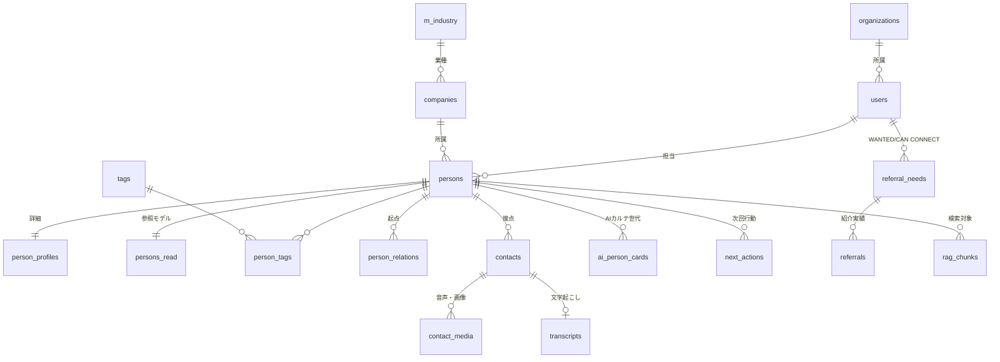

# テーブル設計書

| 項目 | 内容 |
|---|---|
| プロジェクト名 | GOEN（HUMAN NETWORK OS／人脈OS） |
| 文書バージョン | 1.3 |
| 作成日 | 2026/07/20 |
| 最終更新日 | 2026/07/25 |
| 作成者 | 阿部竜之介 |
| 対象要件 | 要件定義書 v1.2（5.6 データ要件、6 非機能要件） |

## 改訂履歴

| 版 | 日付 | 改訂内容 | 記入者 |
|---|---|---|---|
| 1.0 | 2026/07/20 | 初版作成 | 阿部 |
| 1.1 | 2026/07/25 | 実装内容に合わせて更新。`rag_chunks`の埋め込み次元数を開発時の実測値（multilingual-e5-large、1024次元）に修正し`embedding_dim`列を追加、`source_type`に人物プロフィール用の`profile`を追加（4.2・7.17節）。埋め込みモデルの確定内容を反映（4.4節、D-001解消）。日本語全文検索の採用方式を確定（D-002解消）。`person_relations`の生成経路（AI不使用の自動／手動／AI提案の3方式）を追記（7.8節）。AIプロバイダ構成の詳細は新設の基本設計書_GOEN_v1.0.mdへ分離 | 阿部 |
| 1.2 | 2026/07/25 | `person_relations.relation_type`を`referrer`/`community`の2種類に縮小（`colleague`/`client`/`partner`/`other`を廃止）。同僚・取引先等の組織上／取引上の関係は`person_profiles.note`へテキストとして持たせ、RAG検索の補足情報として提示する方式に変更（7.8節）。移行用に`migrations/0002_person_relations_slim.sql`を追加 | 阿部 |
| 1.3 | 2026/08/02 | 通知機能（F-012、未実装のプレースホルダーのみ）の廃止に伴い`notifications`テーブルと`users.notify_hour`/`notify_settings`列を削除（7.4・7.20節）。代替の紹介文作成機能（F-026）は永続化なしのためテーブル追加なし。移行用に`migrations/0003_drop_notifications.sql`を追加 | 阿部 |

---

## 1. はじめに

### 1.1 本書の目的
要件定義書v1.1で定義した機能要件・非機能要件を実現するための物理データモデルを定義する。本書は詳細設計およびDDL実装（別添 `ddl_goen_v1.0.sql`）のインプットとなる。

### 1.2 前提とするDBMS

| 項目 | 内容 |
|---|---|
| DBMS | PostgreSQL 17以上（国内リージョンのVPS上に構築） |
| 必須拡張 | `pgvector` 0.8以上（ベクトル検索、HNSW＋反復スキャン）、`pgcrypto`（UUID生成） |
| 推奨拡張 | `PGroonga`（日本語全文検索。導入不可の場合は `pg_bigm` で代替） |
| 文字コード | UTF-8 / ロケール C.UTF-8 |

PostgreSQL単体でRDBとベクトル検索を同居させる構成とする。RDBとベクトルDBを分離すると、検索結果のIDから人物情報を取得するために毎回アプリケーション層でのN+1的な結合が発生するため、1名体制の運用負荷と参照性能の両面から単一DBに統合する。

### 1.3 設計要件（本設計で満たすべき条件）

| # | 条件 | 対応する設計方針 |
|---|---|---|
| 1 | RAG検索に適応した設計 | 第4章。チャンク単位のテーブル `rag_chunks` に検索メタデータを非正規化し、ベクトル検索だけで絞り込みが完結する構造とする |
| 2 | 人脈データのバージョン管理（変更前・削除済みデータの保持） | 第3章。カレント／ヒストリ分離方式。トリガで変更前イメージを `h_` テーブルへ自動退避する |
| 3 | 履歴実装による参照性能の劣化を避ける | 第3.2節・第5章。参照系SQLは履歴テーブルを一切参照しない。加えて参照専用の非正規化テーブルを設け、主要画面の結合回数を0〜1回に抑える |
| 4 | 更新頻度・状態でテーブルを分ける | 第2章のテーブル区分。静的マスタ／準マスタ／コア／追記型／参照最適化／検索／システムの7区分に分類し、区分ごとに履歴要否・パーティション方針を定める |

---

## 2. 全体設計方針

### 2.1 テーブル区分

更新頻度と役割によりテーブルを7区分に分類する。区分によって履歴取得の要否、インデックス方針、パーティション方針を統一的に決定する。

| 区分 | 接頭辞 | 更新頻度 | 履歴 | 方針 |
|---|---|---|---|---|
| ① 静的マスタ | `m_` | ほぼ変化しない | 不要 | 全件がキャッシュに載る前提。アプリ起動時にメモリへ読み込み、参照時の結合を行わない |
| ② 準マスタ | なし | 低（月数回） | 要 | 業務データから参照される。表示名は参照モデルへ非正規化する |
| ③ コア業務 | なし | 中〜高 | 要 | カレントのみを保持。行幅を小さく保ち、キャッシュ効率を優先する |
| ④ 追記型 | なし | 高（INSERT中心） | 一部要 | 更新が発生しないものは履歴不要。日時でパーティション化可能な構造とする |
| ⑤ 参照最適化 | `_read` | 書き込み時に同期 | 不要 | 非正規化された読み取り専用テーブル。原本から再構築可能 |
| ⑥ 検索 | `rag_` | 非同期で再構築 | 不要 | 原本から再生成可能なため履歴を持たない |
| ⑦ システム | なし | 高（INSERTのみ） | 不要 | 監査ログ・通知など。月次パーティション＋定期アーカイブ |
| ⑧ 履歴 | `h_` | INSERTのみ | － | 参照系からは触らない。月次パーティション |

### 2.2 共通設計ルール

**主キー**
- 全テーブルでUUID v7（時系列ソート可能なUUID）を採用する。
- 理由：①オフライン時に端末側でIDを採番でき、通信復帰後にそのまま送信できる（要件F-009の通信断時の端末保持に対応）、②連番UUIDのためB-treeインデックスの挿入が末尾に集中し、ランダムUUIDのようなページ分断が起きない。
- PostgreSQL 18以降は組込みの `uuidv7()`、17以前はアプリ側またはSQL関数で生成する。

**共通カラム**

| カラム名 | 型 | 説明 |
|---|---|---|
| `created_at` | timestamptz | 作成日時 |
| `created_by` | uuid | 作成ユーザーID |
| `updated_at` | timestamptz | 更新日時（トリガで自動更新） |
| `updated_by` | uuid | 更新ユーザーID |
| `version` | integer | 楽観ロック用の版数。更新のたびにトリガで+1する |

**区分値の扱い**
- 状態・種別などの区分値は、コードマスタを作らず `text` + `CHECK` 制約でテーブルに直接保持する。
- 理由：区分値の解決のために毎回JOINを発生させないため（設計要件3）。表示名はアプリケーション側の定数で保持する。
- ただし「業種」「都道府県」は検索・マッチングの絞り込み条件かつ将来的な追加が想定されるため、静的マスタとして独立させる。

**削除方式**
- 論理削除フラグ（`deleted_at`）は原則として使用しない。削除時はカレントテーブルから物理削除し、削除直前の行イメージを履歴テーブルへ退避する。
- 理由：論理削除を使うと、すべての参照SQLに `WHERE deleted_at IS NULL` が必要となり、削除済み行がインデックスに残り続けて参照性能を劣化させる。カレントテーブルには「アプリ上で見えるデータ」だけを置くことで、参照経路を最短にする（設計要件2・3の両立）。
- 削除データは履歴テーブルに残るため、管理機能から復元できる。

**命名規約**
- テーブル名：英小文字スネークケース、複数形（例：`persons`）
- 履歴テーブル名：`h_` ＋ 元テーブル名（例：`h_persons`）
- インデックス名：`ix_テーブル名_カラム名`、一意制約は `ux_`、外部キーは `fk_`

### 2.3 ER概要



履歴テーブル（`h_*`）は上記のいずれのリレーションにも参加しない独立したテーブルとして配置する。

---

## 3. バージョン管理（履歴）設計

### 3.1 方式：カレント／ヒストリ分離

| 項目 | 内容 |
|---|---|
| 方式 | カレントテーブルは常に最新の1行のみを保持する。UPDATE／DELETE時に、変更前の行イメージ（OLD）をトリガで対応する `h_` テーブルへINSERTする |
| INSERT時 | 履歴は作成しない（カレント側が version = 1 の初版そのものであるため） |
| UPDATE時 | 変更前の行を `operation = 'U'` として履歴へ退避し、カレントの `version` を+1する |
| DELETE時 | 削除される行を `operation = 'D'` として履歴へ退避する |
| 全バージョンの再現 | 「対象レコードの `h_` テーブルの全行」＋「カレントの1行」で、初版から現在までの全世代が再現できる |
| 履歴テーブルの構造 | カレントテーブルと同一のカラム構成（`LIKE` で定義）＋履歴用カラム4つ。カレント側にカラムを追加した際は履歴側にも同じ追加を行う |

**履歴用の追加カラム**

| カラム名 | 型 | 説明 |
|---|---|---|
| `history_id` | uuid | 履歴レコードの主キー |
| `operation` | char(1) | `U`=更新前 / `D`=削除前 |
| `changed_at` | timestamptz | 変更発生日時（パーティションキー） |
| `changed_by` | uuid | 変更実行ユーザーID |

**履歴を取得するテーブル**

`h_users` / `h_companies` / `h_tags` / `h_persons` / `h_person_profiles` / `h_person_tags` / `h_person_relations` / `h_contacts` / `h_contact_media` / `h_transcripts` / `h_next_actions` / `h_referral_needs` / `h_referrals`

**履歴を取得しないテーブル（理由）**

| テーブル | 理由 |
|---|---|
| `m_industry` / `m_prefecture` | 静的マスタ。変更時は手順書に基づく管理作業とし、監査ログで追跡する |
| `ai_person_cards` | テーブル自体が世代管理構造（生成のたびに新行を追加し、最新行のみ `is_latest = true`）。二重に履歴を持たない |
| `persons_read` | 原本から再構築可能な派生データ |
| `rag_chunks` | 原本から再生成可能な派生データ |
| `notifications` / `audit_logs` / `ai_api_logs` | 追記のみで更新が発生しない |

### 3.2 参照性能への配慮（設計要件3への対応）

履歴実装で性能が劣化する典型パターンは、「有効期間（valid_from / valid_to）を持つ1つのテーブルに全世代を格納し、参照のたびに `WHERE valid_to IS NULL` で最新行を絞り込む」方式である。この方式では、

- カレント行がテーブル全体の数%になり、インデックスとテーブルの物理サイズが世代数に比例して肥大化する
- 人物・接点・関係など複数テーブルを結合するたびに、各テーブルで世代の絞り込み条件が必要になり、結合コストが世代数に比例して増える

本設計ではこれを避け、**カレントと履歴を物理的に別テーブルへ分離**する。この結果、

- 参照系SQLは履歴テーブルを一度も参照しない。履歴が何世代蓄積してもカレントテーブルのサイズは変わらず、参照性能は劣化しない
- 参照SQLに世代絞り込みの条件が不要になり、結合条件が単純になる
- 履歴の書き込みは同一トランザクション内のINSERT 1件のみで、更新処理へのオーバーヘッドが小さい

履歴の参照は「管理画面での変更履歴表示」「誤削除データの復元」に限定され、頻度が低く応答時間の要求も緩い。そのため履歴テーブル側にはPKと `(元テーブルのID, changed_at)` の複合インデックスのみを張り、書き込みコストを最小化する。

### 3.3 パーティション

`h_*` テーブルは `changed_at` によるRANGEパーティション（月次）とする。

- 主キーは `(history_id, changed_at)` の複合とする（パーティションキーを含める必要があるため）
- 保管期間を超えたパーティションは `DETACH` して退避することで、削除にかかる負荷を回避する
- 保管期間は監査ログ要件に合わせ3年とする（要件定義書 第6章）

### 3.4 履歴からの復元

| 操作 | 手順 |
|---|---|
| 変更履歴の表示 | `h_persons` を `person_id` で検索し `changed_at` 降順に取得。カレント行を先頭に付加して表示する |
| 特定時点の値の再現 | `changed_at > 指定時刻` の履歴のうち最も古い行が、その時点の値となる。該当がなければカレント行が該当する |
| 削除データの復元 | `operation = 'D'` の履歴行から共通カラムを再設定してカレントテーブルへINSERTする。関連する子テーブルも同一の `changed_at` を持つ履歴から同時に復元する |

---

## 4. RAG検索設計

### 4.1 設計方針

要件F-004では、氏名を用いずに「課題・ニーズ」「紹介可能性」「場所・時期・属性」「接触履歴」から人物を特定する必要がある。これを満たすため以下の方針を採る。

| # | 方針 | 内容 |
|---|---|---|
| 1 | チャンク単位での格納 | 人物単位ではなくチャンク単位で埋め込みを保持する。1人物に複数の接点・文字起こしがあるため、人物単位に集約すると個々の会話内容の意味がベクトル上で平均化され、検索精度が落ちる |
| 2 | メタデータの非正規化 | 検索時の絞り込みに使う項目（所有ユーザー、組織、公開範囲、業種、都道府県、人物ID、発生日）を `rag_chunks` 側へコピーして保持する。ベクトル検索の前段でJOINせずに絞り込めるようにするため（設計要件3） |
| 3 | ハイブリッド検索 | ベクトル検索（意味の近さ）と全文検索（固有名詞の一致）の結果をRRF（Reciprocal Rank Fusion）で統合する。「京都」「工務店」のような固有名詞はベクトル検索単独では取りこぼしやすいため |
| 4 | 非同期での再構築 | 原本の更新時はキューテーブルへ登録するのみとし、埋め込み生成は別プロセスで行う。外部LLM APIの応答時間（最大数秒）がユーザーの保存操作をブロックしないようにする |
| 5 | 検索結果の返却 | 検索結果は人物IDへ集約し、表示用データは `persons_read` から1回のアクセスで取得する |

### 4.2 チャンク化ルール

| ソース種別（`source_type`） | 元テーブル | チャンク化の単位 |
|---|---|---|
| `profile` | `persons` / `person_profiles`（`persons_read`相当の非正規化情報） | 氏名・会社名・業種・都道府県・役職・メモを1チャンクに集約。曖昧検索で地域・所属等から人物を探せるようにするため実装時に追加した種別 |
| `card` | `ai_person_cards` | AI要約＋事業＋課題＋趣味をまとめて1チャンク |
| `transcript` | `transcripts` | 本文を500〜800文字（前後100文字のオーバーラップ付き）で分割 |
| `note` | `contacts` | 接点メモ1件＝1チャンク |
| `need` | `referral_needs` | 紹介ニーズ1件＝1チャンク（Phase3未実装のため`rag_chunks`への投入は未着手） |

チャンク本文の先頭には「氏名／会社名／接点日／場所」を固定フォーマットのヘッダとして埋め込む。埋め込みベクトルに文脈情報を含めることで、「去年、京都の交流会で会った女性」のような時期・場所を含むクエリの精度を上げる。

### 4.3 インデックス

| 対象 | インデックス | 備考 |
|---|---|---|
| `embedding` | HNSW（`vector_cosine_ops`, m=16, ef_construction=64） | 検索時は `hnsw.ef_search = 100`、`hnsw.iterative_scan = relaxed_order` を設定し、メタデータ絞り込みとの併用時も件数を確保する |
| `content` | pg_trgm（トライグラム類似検索） | 開発用Dockerイメージ（pgvector/pgvector）にPGroongaが同梱されないため、D-002はpg_trgmの採用で確定した。本番導入時にPGroonga／pg_bigmへの切替を再検討する余地は残す |
| 絞り込み用 | `(owner_user_id, person_id)`、`(owner_user_id, occurred_at DESC)` | ベクトル検索前のフィルタおよび接触履歴検索に使用 |

### 4.4 埋め込みモデルの切り替え

`rag_chunks` に `embedding_model` と `embedding_dim` を保持し、モデル変更時は新旧を併存させたうえで切り替える。ベクトル型の次元数は固定のため、次元数が異なるモデルへ移行する場合は新テーブル（`rag_chunks_v2`）を作成し、再生成完了後にリネームで切り替える手順とする。

**実装時の確定内容（D-001解消）**

| 環境 | 埋め込みモデル | 次元数 | `embedding`列 |
|---|---|---|---|
| 開発・モック | multilingual-e5-large-instruct（Ollamaでローカル実行） | 1024 | `vector(1024)`（現行スキーマ） |
| 本番想定 | text-embedding-3-small（OpenAI） | 1536 | 切替時は上記の新テーブル作成手順で移行 |

開発・本番で次元数が異なる埋め込みモデルを採用する方針としたため、`embedding`列は開発環境の値（1024次元）に合わせて定義する。本番切替時のベクトル空間の非互換性は埋め込みモデル一般に共通する制約であり、切替時は全チャンクの再生成が前提となる（コード側は`IEmbeddingService`実装の差し替えのみで対応できるが、データの再生成は別途必要）。詳細は基本設計書_GOEN_v1.0.md「AIプロバイダ構成」を参照。

---

## 5. 参照性能設計

### 5.1 参照モデル `persons_read`

人物カルテ画面（S-006）および人物一覧（S-007）は最も参照頻度が高い。正規化された構成のままでは、1画面の表示に `persons` / `person_profiles` / `companies` / `m_industry` / `tags` / `ai_person_cards` / `next_actions` / `contacts` の8テーブルの結合と集約が必要になる。

これを避けるため、表示に必要な情報を1行に集約した参照専用テーブル `persons_read` を設ける。

| 特徴 | 内容 |
|---|---|
| 粒度 | 人物1件＝1行（`person_id` が主キー） |
| 更新契機 | 元テーブルの更新トリガから同期更新する。ただしAIカルテ生成のような重い処理は非同期キュー経由とする |
| 保持内容 | 氏名・会社名・業種名・都道府県名・重要度・最終接触日・接点件数・タグ配列・AI要約・次回アクション（内容と期限）・公開範囲 |
| 型 | 単純な項目は列として、タグや次回アクションのような可変長データは `jsonb` として保持する |
| 再構築 | 原本テーブルから全件再生成するバッチを用意する（不整合発生時のリカバリ手段） |

これにより、人物一覧・検索結果の表示は `persons_read` 単体へのアクセス（結合0回）、カルテ画面は `persons_read` ＋ `contacts`（接点履歴）の2テーブルで完結する。

### 5.2 `persons` と `person_profiles` の分割

人物データを更新頻度と参照頻度で2テーブルに分割する。

| テーブル | 保持する項目 | 更新頻度 | 参照頻度 |
|---|---|---|---|
| `persons` | 氏名、カナ、会社ID、役職、担当ユーザー、重要度、公開範囲、最終接触日 | 高 | 高 |
| `person_profiles` | 電話番号、メールアドレス、住所、URL、生年月日、備考（長文） | 低 | 低（詳細表示時のみ） |

理由：PostgreSQLはページ単位（8KB）でデータを読み込むため、行幅が小さいほど1ページに載る行数が増え、一覧取得時のI/Oとキャッシュ効率が向上する。長文の備考やほとんど参照されない連絡先を同一行に持たせると、一覧取得のたびに不要なデータを読み込むことになる。

### 5.3 人脈グラフ（F-005／F-006）の参照

グラフ描画は `person_relations` を起点とする探索処理となるため、以下の方針とする。

- 初期表示は「自分から距離1〜2」かつ「重要度★3以上」に限定する（要件のリスクR-007への対応）
- 再帰的な探索が必要な場合は再帰CTE（`WITH RECURSIVE`）を用い、深さの上限を3とする
- `person_relations` には `(from_person_id, to_person_id)` と `(to_person_id, from_person_id)` の双方向インデックスを張り、どちらの方向からの探索でもインデックスが効くようにする
- 探索の結果得られた人物IDに対する表示情報は `persons_read` から一括取得する（`WHERE person_id = ANY($1)`）

### 5.4 主要画面ごとのアクセス経路

| 画面 | アクセスするテーブル | 結合回数 |
|---|---|---|
| S-002 ホーム | `notifications`、`persons_read` | 0 |
| S-006 人物カルテ | `persons_read`、`contacts`（時系列） | 1 |
| S-007 人物一覧 | `persons_read` | 0 |
| S-008 検索 | `rag_chunks` → `persons_read` | 1 |
| S-009 人脈マップ | `person_relations`（再帰CTE）→ `persons_read` | 1 |
| 詳細表示・編集 | `persons`、`person_profiles` | 1 |
| 変更履歴表示（管理） | `h_persons` | 0 |

---

## 6. テーブル一覧

| # | 区分 | テーブル名 | 論理名 | 想定件数 | 履歴 | パーティション |
|---|---|---|---|---|---|---|
| 1 | ① 静的マスタ | `m_industry` | 業種マスタ | 約100 | － | － |
| 2 | ① 静的マスタ | `m_prefecture` | 都道府県マスタ | 47 | － | － |
| 3 | ② 準マスタ | `organizations` | 組織 | 〜100 | ○ | － |
| 4 | ② 準マスタ | `users` | ユーザー | 〜1,000 | ○ | － |
| 5 | ② 準マスタ | `companies` | 企業 | 〜20,000 | ○ | － |
| 6 | ② 準マスタ | `tags` | タグ | 〜1,000 | ○ | － |
| 7 | ③ コア業務 | `persons` | 人物 | 〜300,000 | ○ | － |
| 8 | ③ コア業務 | `person_profiles` | 人物詳細 | 〜300,000 | ○ | － |
| 9 | ③ コア業務 | `person_tags` | 人物タグ | 〜900,000 | ○ | － |
| 10 | ③ コア業務 | `person_relations` | 人脈関係（エッジ） | 〜1,000,000 | ○ | － |
| 11 | ③ コア業務 | `next_actions` | 次回アクション | 〜300,000 | ○ | － |
| 12 | ③ コア業務 | `referral_needs` | 紹介ニーズ | 〜50,000 | ○ | － |
| 13 | ③ コア業務 | `referrals` | 紹介実績 | 〜50,000 | ○ | － |
| 14 | ④ 追記型 | `contacts` | 接点ログ | 〜1,000,000 | ○ | 年次（将来） |
| 15 | ④ 追記型 | `contact_media` | 接点メディア（音声・名刺画像） | 〜1,000,000 | ○ | － |
| 16 | ④ 追記型 | `transcripts` | 文字起こし | 〜1,000,000 | ○ | － |
| 17 | ④ 追記型 | `ai_person_cards` | AI人物カルテ（世代管理） | 〜1,500,000 | － | － |
| 18 | ④ 追記型 | `briefs` | 商談前ブリーフ | 〜200,000 | － | － |
| 19 | ⑤ 参照最適化 | `persons_read` | 人物参照モデル | 〜300,000 | － | － |
| 20 | ⑥ 検索 | `rag_chunks` | RAGチャンク | 〜5,000,000 | － | － |
| 21 | ⑥ 検索 | `rag_index_queue` | 埋め込み再生成キュー | 〜10,000 | － | － |
| 22 | ⑦ システム | `auth_tokens` | 認証トークン | 〜10,000 | － | － |
| 23 | ⑦ システム | `notifications` | 通知 | 〜3,000,000 | － | 月次 |
| 24 | ⑦ システム | `audit_logs` | 監査ログ | 〜10,000,000 | － | 月次 |
| 25 | ⑦ システム | `ai_api_logs` | 外部AI API呼出ログ | 〜3,000,000 | － | 月次 |
| 26 | ⑦ システム | `import_jobs` | データ移行ジョブ | 〜1,000 | － | － |
| 27 | ⑧ 履歴 | `h_*`（13テーブル） | 各テーブルの履歴 | 元テーブルの3〜5倍 | － | 月次 |

---

## 7. テーブル定義

以下、主要テーブルの定義を示す。PK＝主キー、FK＝外部キー、NN＝NOT NULL。共通カラム（`created_at` / `created_by` / `updated_at` / `updated_by` / `version`）は紙面の都合により省略し、保持するテーブルにその旨を記載する。完全な定義は別添DDLを参照。

### 7.1 m_industry（業種マスタ）※共通カラムなし

| カラム名 | 型 | 制約 | 説明 |
|---|---|---|---|
| industry_code | varchar(10) | PK | 業種コード（日本標準産業分類の中分類に準拠） |
| industry_name | text | NN | 業種名 |
| parent_code | varchar(10) | FK(self) | 上位業種コード |
| sort_order | integer | NN | 表示順 |
| is_active | boolean | NN | 有効フラグ |

### 7.2 m_prefecture（都道府県マスタ）※共通カラムなし

| カラム名 | 型 | 制約 | 説明 |
|---|---|---|---|
| pref_code | char(2) | PK | 都道府県コード（JIS X 0401） |
| pref_name | text | NN | 都道府県名 |
| region_name | text | NN | 地方区分（関西、関東 等）。F-016の「紹介可能地域」の絞り込みに使用 |

### 7.3 organizations（組織）※共通カラムあり

| カラム名 | 型 | 制約 | 説明 |
|---|---|---|---|
| org_id | uuid | PK | 組織ID |
| org_name | text | NN | 組織名 |
| parent_org_id | uuid | FK(self) | 上位組織ID |
| plan_type | text | NN, CHECK | 契約区分（`personal` / `team` / `enterprise`） |

### 7.4 users（ユーザー）※共通カラムあり

| カラム名 | 型 | 制約 | 説明 |
|---|---|---|---|
| user_id | uuid | PK | ユーザーID |
| org_id | uuid | FK, NN | 所属組織ID |
| email | citext | NN, UQ | メールアドレス |
| password_hash | text | NN | パスワードハッシュ（Argon2id） |
| display_name | text | NN | 表示名 |
| role | text | NN, CHECK | ロール（`member` / `manager` / `org_admin` / `sys_admin`） |
| status | text | NN, CHECK | 状態（`active` / `suspended` / `retired`）。退職者の人脈引き継ぎ（F-019）に使用 |
| last_login_at | timestamptz | | 最終ログイン日時 |

### 7.5 companies（企業）※共通カラムあり

| カラム名 | 型 | 制約 | 説明 |
|---|---|---|---|
| company_id | uuid | PK | 企業ID |
| company_name | text | NN | 企業名 |
| company_name_kana | text | | 企業名カナ |
| industry_code | varchar(10) | FK | 業種コード |
| pref_code | char(2) | FK | 所在都道府県コード |
| address | text | | 住所 |
| url | text | | 企業URL |
| employee_scale | text | CHECK | 従業員規模区分 |

`company_name` には正規化のゆらぎ（「株式会社」の位置、全半角）が発生するため、正規化済みの検索用カラムを別途持ち、一意制約ではなく重複候補の提示（F-007）に用いる。

### 7.6 persons（人物）※共通カラムあり

参照頻度が最も高いテーブル。行幅を小さく保つ。

| カラム名 | 型 | 制約 | 説明 |
|---|---|---|---|
| person_id | uuid | PK | 人物ID |
| org_id | uuid | FK, NN | 所属組織ID（データの所有組織） |
| owner_user_id | uuid | FK, NN | 担当ユーザーID |
| company_id | uuid | FK | 所属企業ID |
| full_name | text | NN | 氏名 |
| full_name_kana | text | | 氏名カナ |
| department | text | | 部署 |
| job_title | text | | 役職 |
| importance | smallint | NN, CHECK(1-5) | 重要度（★1〜★5） |
| importance_is_manual | boolean | NN | 重要度を手動設定したか（trueの場合F-022の自動算出で上書きしない） |
| visibility | text | NN, CHECK | 公開範囲（`private` / `team` / `org`） |
| first_met_at | date | | 初回接点日 |
| last_contact_at | timestamptz | | 最終接触日時（F-012の未接触抽出に使用） |
| introducer_person_id | uuid | FK(self) | 紹介者となった人物ID |
| source_type | text | NN, CHECK | 登録経路（`card_ocr` / `manual` / `import`） |

主なインデックス：`(owner_user_id, last_contact_at DESC)`、`(org_id, company_id)`、`(full_name_kana)`、`(introducer_person_id)`

### 7.7 person_profiles（人物詳細）※共通カラムあり

| カラム名 | 型 | 制約 | 説明 |
|---|---|---|---|
| person_id | uuid | PK, FK | 人物ID（`persons` と1対1） |
| tel | text | | 電話番号 |
| mobile | text | | 携帯番号 |
| email | text | | メールアドレス |
| pref_code | char(2) | FK | 都道府県コード |
| address | text | | 住所 |
| url | text | | URL |
| sns_accounts | jsonb | | SNSアカウント（キー＝サービス名） |
| birthday | date | | 生年月日 |
| note | text | | 自由記述メモ（長文）。同僚・取引先等、person_relationsにエッジ化しない人脈の文脈情報もここに記録し、RAGチャンク（`source_type='profile'`）を通じてAIアシスタントの補足情報検索の対象になる |

### 7.8 person_relations（人脈関係／エッジ）※共通カラムあり

| カラム名 | 型 | 制約 | 説明 |
|---|---|---|---|
| relation_id | uuid | PK | 関係ID |
| org_id | uuid | FK, NN | 所属組織ID |
| from_person_id | uuid | FK, NN | 起点人物ID |
| to_person_id | uuid | FK, NN | 終点人物ID |
| relation_type | text | NN, CHECK | 関係種別（`referrer`＝紹介元 / `community`＝人脈・知人） |
| strength | smallint | NN, CHECK(1-5) | 関係の強さ。グラフの線の太さに対応（算出ロジックはQ-010で未決） |
| strength_is_manual | boolean | NN | 強さを手動設定したか |
| is_bidirectional | boolean | NN | 双方向関係か |
| note | text | | 補足 |

一意制約：`(from_person_id, to_person_id, relation_type)`
インデックス：`(from_person_id, strength DESC)`、`(to_person_id, strength DESC)`

**設計方針**：本テーブルは「紹介経路探索（BFS）に使える人脈のつながり」のみをエッジとして持つ。同僚・取引先・パートナーのような組織上／取引上の関係は`relation_type`を持たず、`person_profiles.note`（人物カルテのメモ）にテキストとして記録し、RAG検索（`rag_chunks`、AIアシスタント機能）の補足情報として提示する方式に統一している。会社名が一致するだけの関係を自動でエッジ化すると、同じ会社に多数の人物が登録された際に組み合わせ爆発を起こす上、紹介経路探索のノイズにもなるため、この分離により人脈マップの表示・経路探索の両方をシンプルに保っている。

**実装状況**：レコードの生成経路は3方式ある（要件定義書F-005参照）。
1. AI不使用・自動：登録時に選択式で指定した紹介者による`referrer`の自動生成（LLM呼び出しなし）
2. AI不使用・手動：利用者が相手・関係種別（`referrer`/`community`）・強さを指定して直接登録
3. AI提案：LLMが候補者一覧と比較して`referrer`/`community`のいずれかを提案し、利用者が確認のうえ選択登録

いずれの経路でも本テーブルへの書き込み形式は同一であり、`strength_is_manual`で手動確定済みかを区別する。人脈マップの経路探索（AIアシスタント機能）は本テーブルを組織スコープで全件メモリへ読み込み、幅優先探索（BFS）で最短経路を求める（`Goen.Infrastructure.Rag.AiAssistantService`）。

### 7.9 contacts（接点ログ）※共通カラムあり

| カラム名 | 型 | 制約 | 説明 |
|---|---|---|---|
| contact_id | uuid | PK | 接点ID |
| org_id | uuid | FK, NN | 所属組織ID |
| person_id | uuid | FK, NN | 人物ID |
| user_id | uuid | FK, NN | 実施ユーザーID |
| contact_type | text | NN, CHECK | 種別（`card_exchange` / `one_on_one` / `meeting` / `referral` / `event` / `other`） |
| occurred_at | timestamptz | NN | 発生日時 |
| place | text | | 場所（「京都の交流会」等。曖昧検索の手がかりとなる） |
| note | text | | メモ |
| has_media | boolean | NN | 音声・画像の有無（`contact_media` への結合要否を事前判定するためのフラグ） |

インデックス：`(person_id, occurred_at DESC)`、`(user_id, occurred_at DESC)`

### 7.10 contact_media（接点メディア）※共通カラムあり

| カラム名 | 型 | 制約 | 説明 |
|---|---|---|---|
| media_id | uuid | PK | メディアID |
| contact_id | uuid | FK, NN | 接点ID |
| media_type | text | NN, CHECK | 種別（`business_card` / `audio` / `image` / `document`） |
| storage_path | text | NN | オブジェクトストレージ上のパス |
| file_size | bigint | NN | ファイルサイズ（バイト） |
| duration_sec | integer | | 音声の長さ（秒） |
| ocr_confidence | numeric(4,3) | | OCR信頼度（名刺の場合） |
| ocr_raw | jsonb | | OCR APIの生レスポンス（再処理・精度検証用） |
| upload_status | text | NN, CHECK | 状態（`pending` / `uploaded` / `failed`）。オフライン時の端末保持からの復帰に使用 |

バイナリ本体はDBに格納せず、オブジェクトストレージのパスのみを保持する。

### 7.11 transcripts（文字起こし）※共通カラムあり

| カラム名 | 型 | 制約 | 説明 |
|---|---|---|---|
| transcript_id | uuid | PK | 文字起こしID |
| contact_id | uuid | FK, NN | 接点ID |
| media_id | uuid | FK | 元となった音声メディアID |
| content | text | NN | 文字起こし本文 |
| content_edited | boolean | NN | 利用者が編集したか |
| confidence | numeric(4,3) | | 認識信頼度（閾値未満で警告表示） |
| asr_model | text | NN | 使用した音声認識モデル名 |
| language | text | NN | 言語コード |
| status | text | NN, CHECK | 状態（`processing` / `done` / `failed`） |

### 7.12 ai_person_cards（AI人物カルテ）※共通カラムあり／世代管理テーブル

生成のたびに新規行を追加する追記型とし、最新行のみ `is_latest = true` とする。履歴テーブルを持たない。

| カラム名 | 型 | 制約 | 説明 |
|---|---|---|---|
| card_id | uuid | PK | カルテID |
| person_id | uuid | FK, NN | 人物ID |
| generation | integer | NN | 世代番号 |
| is_latest | boolean | NN | 最新世代フラグ |
| summary | text | | AI要約（3〜5文） |
| business | text | | 事業内容 |
| issues | text | | 抱える課題 |
| introducer_name | text | | 紹介者 |
| hobby | text | | 趣味・人柄 |
| strengths | text | | 強み（1to1後の整理、F-013） |
| wanted_summary | text | | 欲しい紹介の要約 |
| field_sources | jsonb | NN | 項目ごとの生成元（`ai` / `user`）。利用者が修正した項目をAIが上書きしないための制御に使用（F-010の業務ルール） |
| llm_model | text | NN | 使用モデル名 |
| generated_at | timestamptz | NN | 生成日時 |
| input_contact_ids | uuid[] | | 生成入力に用いた接点IDの配列 |

一意インデックス：`(person_id) WHERE is_latest`（最新世代が常に1件であることを保証し、参照時のソートを不要にする）

### 7.13 next_actions（次回アクション）※共通カラムあり

| カラム名 | 型 | 制約 | 説明 |
|---|---|---|---|
| action_id | uuid | PK | アクションID |
| person_id | uuid | FK, NN | 人物ID |
| user_id | uuid | FK, NN | 担当ユーザーID |
| content | text | NN | 内容 |
| due_date | date | | 期限 |
| status | text | NN, CHECK | 状態（`open` / `done` / `canceled`） |
| completed_at | timestamptz | | 完了日時 |
| source_contact_id | uuid | FK | 発生元の接点ID |

インデックス：`(user_id, due_date) WHERE status = 'open'`（F-012の通知抽出を部分インデックスで高速化する）

### 7.14 referral_needs（紹介ニーズ）※共通カラムあり

| カラム名 | 型 | 制約 | 説明 |
|---|---|---|---|
| need_id | uuid | PK | ニーズID |
| user_id | uuid | FK, NN | 登録ユーザーID |
| person_id | uuid | FK | 対象人物ID（他者の紹介ニーズを代理登録する場合） |
| kind | text | NN, CHECK | 区分（`wanted` / `can_connect`） |
| title | text | NN | 見出し |
| description | text | | 詳細条件 |
| target_industry_codes | varchar(10)[] | | 対象業種コード配列 |
| target_pref_codes | char(2)[] | | 対象都道府県コード配列 |
| target_job_titles | text[] | | 対象役職 |
| visibility | text | NN, CHECK | 公開範囲（`private` / `team` / `org` / `community`） |
| valid_from | date | NN | 有効開始日 |
| valid_to | date | | 有効終了日（超過分はマッチング対象外） |
| status | text | NN, CHECK | 状態（`active` / `fulfilled` / `expired`） |

インデックス：`(kind, status, valid_to)`、`target_industry_codes` へのGINインデックス（配列の重なり判定 `&&` を高速化）

### 7.15 referrals（紹介実績）※共通カラムあり

| カラム名 | 型 | 制約 | 説明 |
|---|---|---|---|
| referral_id | uuid | PK | 紹介ID |
| need_id | uuid | FK | 起点となった紹介ニーズID |
| from_user_id | uuid | FK, NN | 紹介元ユーザーID |
| to_person_id | uuid | FK, NN | 紹介先人物ID |
| target_person_id | uuid | FK, NN | 紹介対象人物ID |
| match_score | numeric(5,4) | | AIによるマッチスコア |
| match_reason | jsonb | | 紹介理由（課題×強み／地域×業種／信頼度×関係性の3観点） |
| referral_text | text | | AIが生成した紹介文 |
| consent_from_at | timestamptz | | 紹介元側の同意日時 |
| consent_to_at | timestamptz | | 紹介先側の同意日時 |
| status | text | NN, CHECK | 状態（`proposed` / `consented` / `introduced` / `met` / `deal` / `declined`） |
| introduced_at | timestamptz | | 紹介実行日時 |
| result_note | text | | 結果 |
| is_deal | boolean | NN | 案件化の有無 |

`status` が `introduced` 以降へ遷移するには `consent_from_at` と `consent_to_at` の双方が設定されていることをCHECK制約で保証する。これにより「AIが同意なく連絡先を共有しない」という要件（F-008業務ルール、受入基準A-009）をDB層でも担保する。

### 7.16 persons_read（人物参照モデル）※更新日時のみ保持

| カラム名 | 型 | 制約 | 説明 |
|---|---|---|---|
| person_id | uuid | PK, FK | 人物ID |
| org_id | uuid | NN | 所属組織ID |
| owner_user_id | uuid | NN | 担当ユーザーID |
| visibility | text | NN | 公開範囲 |
| full_name | text | NN | 氏名 |
| full_name_kana | text | | 氏名カナ |
| company_name | text | | 企業名（非正規化） |
| industry_name | text | | 業種名（非正規化） |
| pref_name | text | | 都道府県名（非正規化） |
| job_title | text | | 役職 |
| importance | smallint | NN | 重要度 |
| summary | text | | AI要約（最新世代） |
| issues | text | | 課題 |
| tags | jsonb | NN | タグ配列 |
| last_contact_at | timestamptz | | 最終接触日時 |
| contact_count | integer | NN | 接点件数 |
| open_action | jsonb | | 未完了の次回アクション（内容・期限） |
| search_text | text | NN | 全文検索用の連結テキスト |
| refreshed_at | timestamptz | NN | 再構築日時 |

インデックス：`(owner_user_id, importance DESC, last_contact_at DESC)`、`(org_id, visibility)`、`search_text` への全文検索インデックス

### 7.17 rag_chunks（RAGチャンク）

| カラム名 | 型 | 制約 | 説明 |
|---|---|---|---|
| chunk_id | uuid | PK | チャンクID |
| org_id | uuid | NN | 所属組織ID（絞り込み用に非正規化） |
| owner_user_id | uuid | NN | 担当ユーザーID（同上） |
| person_id | uuid | FK, NN | 人物ID |
| visibility | text | NN | 公開範囲（同上） |
| source_type | text | NN, CHECK | ソース種別（`profile` / `card` / `transcript` / `note` / `need`）。`profile`は実装時に追加（4.2節） |
| source_id | uuid | NN | ソースレコードID |
| source_version | integer | NN | ソースの版数（再生成の要否判定に使用） |
| chunk_no | integer | NN | チャンク連番 |
| content | text | NN | チャンク本文（ヘッダ付き） |
| embedding | vector(1024) | NN | 埋め込みベクトル。次元数は開発環境の埋め込みモデル（multilingual-e5-large）に合わせて確定（4.4節） |
| embedding_model | text | NN | 埋め込みモデル名 |
| embedding_dim | integer | NN | 埋め込みの次元数（実装時に追加。モデル切替時の整合性チェックに使用） |
| occurred_at | timestamptz | | 元データの発生日時（時期での絞り込みに使用） |
| industry_code | varchar(10) | | 業種コード（同上） |
| pref_code | char(2) | | 都道府県コード（同上） |
| token_count | integer | | トークン数（コスト管理用） |
| created_at | timestamptz | NN | 作成日時 |

一意制約：`(source_type, source_id, chunk_no)`

pgvectorへの読み書きは追加のNuGetパッケージ（`Pgvector.EntityFrameworkCore`等）を導入せず、埋め込みベクトルをPostgreSQLのvector型テキスト表現（`[0.1,0.2,...]`）に変換して`::vector`キャストする方式で実装している（`Goen.Infrastructure.Persistence.PgVectorFormat`）。データ量が増えた場合は専用パッケージの導入を再検討する。

### 7.18 rag_index_queue（埋め込み再生成キュー）

| カラム名 | 型 | 制約 | 説明 |
|---|---|---|---|
| queue_id | uuid | PK | キューID |
| source_type | text | NN | ソース種別 |
| source_id | uuid | NN | ソースID |
| person_id | uuid | NN | 人物ID |
| operation | char(1) | NN | `U`=再生成 / `D`=削除 |
| status | text | NN, CHECK | 状態（`pending` / `processing` / `done` / `failed`） |
| retry_count | integer | NN | リトライ回数 |
| error_message | text | | エラー内容 |
| enqueued_at | timestamptz | NN | 登録日時 |
| processed_at | timestamptz | | 処理日時 |

同一ソースの重複登録を避けるため、`(source_type, source_id) WHERE status = 'pending'` に一意インデックスを設ける。ワーカーは `FOR UPDATE SKIP LOCKED` で取得し、並列処理時の競合を回避する。

**実装状況**：`Goen.Infrastructure.Rag.RagIndexingWorker`（`IHostedService`）として実装済み。人物登録・更新／接点メモ／音声文字起こし／AIカルテ生成の各操作の直後に`RagIndexQueueService`がキューへ投入し（`RagIndexQueueService.EnqueueAsync`）、ワーカーが数秒間隔でポーリングして埋め込み生成・`rag_chunks`への反映を行う。保存操作自体は外部AI呼び出しを待たずに完了する（設計要件4.1-4を満たす）。

### 7.19 audit_logs（監査ログ）

| カラム名 | 型 | 制約 | 説明 |
|---|---|---|---|
| log_id | uuid | PK | ログID |
| occurred_at | timestamptz | NN | 発生日時（パーティションキー） |
| user_id | uuid | | 実行ユーザーID |
| org_id | uuid | | 組織ID |
| operation | text | NN | 操作種別（`view` / `create` / `update` / `delete` / `export` / `login` / `permission_change`） |
| target_table | text | | 対象テーブル |
| target_id | uuid | | 対象レコードID |
| target_count | integer | | 対象件数（エクスポート時） |
| ip_address | inet | | 接続元IP |
| user_agent | text | | ユーザーエージェント |
| detail | jsonb | | 補足情報 |

要件（第6章）の「人物情報の閲覧・編集・削除・エクスポート、権限変更を記録し3年間保管」に対応する。月次パーティションとし、3年経過分をDETACHして退避する。

### 7.20 その他のテーブル

| テーブル | 概要 |
|---|---|
| `tags` / `person_tags` | タグと人物の多対多関連。`person_tags` は `(person_id, tag_id)` の複合主キー |
| `briefs` | 商談前ブリーフ（F-014）。`person_id`、生成日時、要点、質問候補、提案候補、引用元URL配列を保持。追記型 |
| `auth_tokens` | リフレッシュトークン。ハッシュ値・端末情報・有効期限・失効日時を保持 |
| `ai_api_logs` | 外部AI API呼出ログ。API種別、モデル、トークン数、コスト、応答時間、成否。リスクR-003のコスト監視に使用 |
| `import_jobs` | CSVインポートジョブ。ファイル名、件数、成功／失敗件数、エラー明細。移行（I-007）に使用 |

---

## 8. インデックス設計方針

| # | 方針 | 内容 |
|---|---|---|
| 1 | 部分インデックスの活用 | `WHERE status = 'open'`、`WHERE is_latest` のように、参照対象が限定される条件は部分インデックスとする。インデックスサイズを削減し更新コストを抑える |
| 2 | カバリングインデックス | 一覧取得で頻出する `(owner_user_id, last_contact_at DESC) INCLUDE (full_name, importance)` のように、テーブル本体へのアクセスを不要にする |
| 3 | 履歴テーブルは最小限 | `h_*` には主キーと `(元ID, changed_at DESC)` のみを張る。書き込み性能を優先する |
| 4 | 配列カラムはGIN | `target_industry_codes` などの配列は GIN インデックスとし、`&&`（重なり）演算子で絞り込む |
| 5 | 外部キーには必ずインデックス | 親レコード削除時のカスケード処理でテーブル全体走査が発生することを防ぐ |

---

## 9. 想定SQL

### 9.1 ハイブリッド検索（F-004・AI指示機能）

以下は初版（PGroonga前提）のSQL案。実装ではD-002の解消に伴いPGroongaをpg_trgmに置き換えている。

```sql
-- $1: クエリの埋め込みベクトル, $2: クエリ文字列, $3: 実行ユーザーID
WITH vec AS (
  SELECT chunk_id, person_id,
         ROW_NUMBER() OVER (ORDER BY embedding <=> $1) AS rnk
  FROM rag_chunks
  WHERE owner_user_id = $3          -- 事前絞り込み（結合なし）
  ORDER BY embedding <=> $1
  LIMIT 50
),
txt AS (
  SELECT chunk_id, person_id,
         ROW_NUMBER() OVER (ORDER BY pgroonga_score(tableoid, ctid) DESC) AS rnk
  FROM rag_chunks
  WHERE owner_user_id = $3 AND content &@~ $2
  LIMIT 50
),
fused AS (
  SELECT person_id, SUM(1.0 / (60 + rnk)) AS score
  FROM (SELECT * FROM vec UNION ALL SELECT * FROM txt) u
  GROUP BY person_id
  ORDER BY score DESC
  LIMIT 20
)
SELECT r.person_id, r.full_name, r.company_name, r.summary,
       r.last_contact_at, f.score
FROM fused f
JOIN persons_read r USING (person_id)
ORDER BY f.score DESC;
```

結合は最後の `persons_read` との1回のみとなる。

**実装（`Goen.Infrastructure.Rag.RagChunkRepository.SearchAsync`）**：PGroongaの`pgroonga_score`/`&@~`をpg_trgmの`similarity()`/`%`演算子に置き換えている点以外はRRFによる統合方式を踏襲。

```sql
WITH vec AS (
  SELECT chunk_id, person_id, source_type, content,
         ROW_NUMBER() OVER (ORDER BY embedding <=> $1::vector) AS rnk
  FROM rag_chunks
  WHERE owner_user_id = $2
  ORDER BY embedding <=> $1::vector
  LIMIT 50
),
txt AS (
  SELECT chunk_id, person_id, source_type, content,
         ROW_NUMBER() OVER (ORDER BY similarity(content, $3) DESC) AS rnk
  FROM rag_chunks
  WHERE owner_user_id = $2 AND content % $3
  LIMIT 50
),
fused AS (
  SELECT chunk_id, person_id, source_type, content, SUM(1.0 / (60 + rnk)) AS score
  FROM (SELECT * FROM vec UNION ALL SELECT * FROM txt) u
  GROUP BY chunk_id, person_id, source_type, content
)
SELECT chunk_id, person_id, source_type, content, score
FROM fused
ORDER BY score DESC
LIMIT $4;
```

検索結果はチャンク単位のまま`AiAssistantService`へ返し、人物単位への集約（ベストスコアのチャンクを代表として採用）・`persons_read`からの表示情報取得はアプリケーション層で行う（人物名の解決に1回`persons_read`へアクセスする点は初版設計と同じ）。

### 9.2 接触履歴からの検索（「半年以上連絡していない見込み客」）

```sql
SELECT person_id, full_name, company_name, importance, last_contact_at
FROM persons_read
WHERE owner_user_id = $1
  AND importance >= 4
  AND (last_contact_at IS NULL OR last_contact_at < now() - interval '6 months')
ORDER BY importance DESC, last_contact_at NULLS FIRST
LIMIT 50;
```

結合0回で完結する。

### 9.3 変更履歴の表示（管理機能）

```sql
SELECT 'current' AS state, version, full_name, importance, updated_at AS at, updated_by AS by
FROM persons WHERE person_id = $1
UNION ALL
SELECT 'history', version, full_name, importance, changed_at, changed_by
FROM h_persons WHERE person_id = $1
ORDER BY at DESC;
```

---

## 10. 運用・保守

| 項目 | 内容 |
|---|---|
| バックアップ | 日次のフルバックアップ（`pg_basebackup`）＋WALアーカイブによるPITR。14日間保持（要件定義書 第6章） |
| VACUUM | 更新頻度の高い `persons` / `persons_read` は `autovacuum_vacuum_scale_factor = 0.05` に個別設定する |
| パーティション管理 | `pg_partman` により月次パーティションを事前作成し、保持期間超過分をDETACHする |
| 統計情報 | `person_relations` のように相関の強い列の組み合わせには拡張統計（`CREATE STATISTICS`）を定義する |
| 整合性チェック | `persons_read` と原本の件数・更新日時を日次で突合し、差異があれば当該行のみ再構築する |

---

## 11. 未決事項

| ID | 内容 | 決定期限 | 関連 | 状態 |
|---|---|---|---|---|
| D-001 | ~~埋め込みモデルと次元数の確定~~ | ~~基本設計時~~ | 要件Q-004 | **解消**：開発=multilingual-e5-large（1024次元・Ollama）、本番想定=text-embedding-3-small（1536次元・OpenAI）。基本設計書_GOEN_v1.0.md参照 |
| D-002 | ~~日本語全文検索の方式（PGroonga／pg_bigm）の確定~~ | ~~基本設計時~~ | 4.3 | **解消**：開発用DockerイメージにPGroongaが同梱されないためpg_trgmを採用。本番導入時に再検討の余地あり |
| D-003 | 関係の強さ（`strength`）の算出ロジック | 2026/08/09 | 要件Q-010 | 未決。現状はAI提案時3固定・自動生成時3固定・手動登録時は利用者指定 |
| D-004 | 履歴データの保管期間（現状は監査ログに合わせ3年） | 基本設計時 | 要件Q-009 | 未決 |
| D-005 | `persons_read` の更新をトリガ同期とするか非同期キューとするかの最終判断（負荷試験の結果による） | 詳細設計時 | 5.1 | 暫定：アプリケーション層での同期再構築を採用（`PersonReadSyncService`）。負荷試験は未実施のため最終確定ではない |
| D-006 | 音声・名刺画像の保存先（VPSローカル／オブジェクトストレージ）の確定 | 基本設計時 | 7.10 | 未決。開発環境ではダミーパスのみ保存（実ファイルは未保存） |
| D-007 | 組織を跨いだ人物データの重複統合（名寄せ）の方針 | Phase4 | 7.5 | 未決 |
