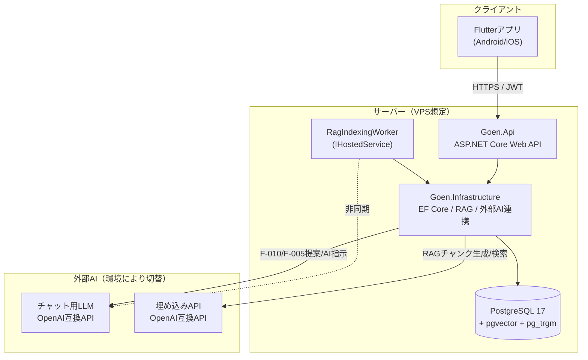
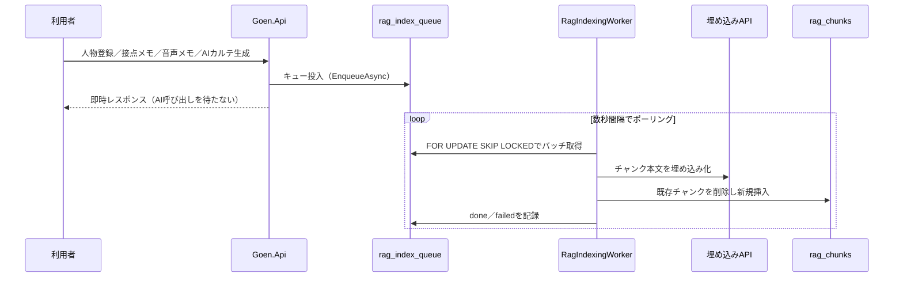
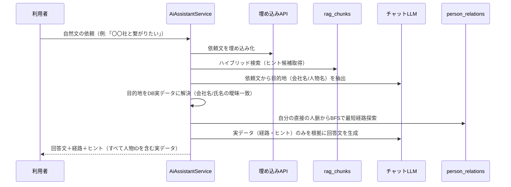

# 基本設計書

| 項目 | 内容 |
|---|---|
| プロジェクト名 | GOEN（HUMAN NETWORK OS／人脈OS） |
| 文書バージョン | 1.3 |
| 作成日 | 2026/07/25 |
| 作成者 | 阿部竜之介 |
| 対象要件 | 要件定義書 v1.5、テーブル設計書 v1.3 |

## 改訂履歴

| 版 | 日付 | 改訂内容 | 記入者 |
|---|---|---|---|
| 1.0 | 2026/07/25 | 初版作成。実装済みのスキャフォールドをもとに、システム構成・AI利用箇所・AIプロバイダ構成（モック／本番）・RAGパイプライン・AIアシスタント（経路提案）・人脈グラフ生成の各設計を記述 | 阿部 |
| 1.1 | 2026/07/25 | 人脈グラフのエッジ種別を`referrer`/`community`の2種類に縮小したことを反映（7章）。同僚等の自動リンクをエッジ生成からカルテメモへの自動追記に変更 | 阿部 |
| 1.2 | 2026/07/26 | 名刺OCR（F-007）をマルチモーダル対応のチャットLLM流用方式（`LlmVisionOcrService`）で実装したことを反映（2.3節・3.1節・8章・9章・13章） | 阿部 |
| 1.3 | 2026/08/02 | 通知機能（F-012、未実装のプレースホルダーのみ）を廃止し、紹介文（例文）作成機能（F-026、`IntroLetterService`）を新設したことを反映（3.1節・8章・9章）。あわせて未反映だったカルテ編集画面・接点詳細画面（メモ編集・Googleカレンダー連携）を画面一覧に追記 | 阿部 |

---

## 1. はじめに

### 1.1 本書の目的
本書は、要件定義書 v1.2・テーブル設計書 v1.1で定義した要件を実現するためのシステム構成・機能設計を記述する。特に、当初の要件定義・テーブル設計の各文書では詳細化されていなかった**AIの利用箇所**、および**モック／開発環境と本番環境で使用するAI APIの違い**を中心にまとめる。

### 1.2 対象範囲・前提
本書は現時点で実装済みのスキャフォールド（土台）を対象とする。Phase2以降（1to1・商談支援、紹介ニーズ管理、チーム共有等）の詳細設計は、当該フェーズの着手時に追補する。

---

## 2. システム構成

### 2.1 全体アーキテクチャ



### 2.2 レイヤー構成

| レイヤー | プロジェクト／ディレクトリ | 役割 |
|---|---|---|
| プレゼンテーション | `mobile/goen_app` | Flutter製モバイルアプリ。Riverpodで状態管理、go_routerで画面遷移 |
| API | `backend/src/Goen.Api` | Controllers、認証（JWT）、DI構成（`Program.cs`） |
| インフラ | `backend/src/Goen.Infrastructure` | EF Core DbContext、外部AI連携（`ExternalAi/`）、RAG（`Rag/`）、人脈グラフ探索（`Persistence/`） |
| ドメイン | `backend/src/Goen.Domain` | エンティティ定義 |
| データストア | PostgreSQL 17（pgvector・pg_trgm・pgcrypto） | RDB・ベクトル検索・トライグラム全文検索を単一DBに統合（テーブル設計書1.2） |

### 2.3 環境構成の違い（モック／開発／本番）

| 項目 | モック（AI未接続） | 開発（Ollama） | 本番想定 |
|---|---|---|---|
| DB | ネイティブPostgreSQLまたはDocker | 同左 | VPS上のPostgreSQL |
| チャットLLM | `MockLlmService`（固定ダミー応答） | Ollama（`gemma3:4b`） | Gemini（`gemini-2.5-flash`） |
| 埋め込み | `MockEmbeddingService`（決定的な疑似ベクトル） | Ollama（`multilingual-e5-large-instruct:q8_0`） | OpenAI（`text-embedding-3-small`） |
| OCR（名刺） | `MockOcrService`（固定ダミー応答） | `LlmVisionOcrService`（Ai:Chat設定を流用し`gemma3:4b`のマルチモーダル入力で読み取り） | Ai:Chat設定を流用し`gemini-2.5-flash`で読み取り想定（専用OCR APIは不要） |
| 音声認識 | ダミー実装（固定値） | 同左（未選定のため） | 未選定（Q-004） |
| 切替方法 | 既定値（`Ai:Chat:Provider`/`Ai:Embedding:Provider` = `mock`） | User Secretsに`ollama`を設定 | User Secretsに`gemini`/`openai`を設定 |
| コスト | 無料 | 無料（ローカル実行、要GPU/CPUリソース） | 従量課金（APIコール数・トークン数に依存） |
| 応答速度 | 即時 | 数秒〜1分程度（ローカル推論、初回モデルロードは特に遅い） | 数秒程度（クラウドAPI） |

「テスト環境」を独立して設けていない（開発＝モックまたはOllama、本番＝クラウドAPIの2区分）。CI等で自動テストを行う場合はモック（`mock`）を使用し、外部ネットワーク・GPUに依存しない構成とする。

---

## 3. AI利用箇所

要件定義書 v1.2で「人脈マップ画面自体はAIを使用しない」という設計方針を明文化した（F-006）。以下に、アプリ内でAIを使用する箇所・使用しない箇所を明確に整理する。

### 3.1 AIを使用する機能

| 機能ID | 画面／処理 | AI種別 | 用途 | AI障害時の挙動 |
|---|---|---|---|---|
| F-007 | 名刺撮影「この名刺を読み取る」 | チャットLLM（マルチモーダル） | 名刺画像から氏名・会社名・部署・役職・連絡先をJSONで抽出（`LlmVisionOcrService`、Ai:Chat設定を流用） | 例外を返す（利用者が再撮影または手入力に切替） |
| F-010 | 人物カルテ「AIカルテを生成する」 | チャットLLM | 名刺情報・音声メモ・商談メモから人物カルテ項目（要約・事業・課題・紹介者・趣味）を抽出 | 例外を返す（利用者が再実行） |
| F-005（提案経路） | 人物カルテ「AIに関係性を提案してもらう」 | チャットLLM | 候補者一覧と対象人物を比較し、人脈関係（紹介者／人脈・知人）を提案 | 例外を返す（利用者が再実行） |
| F-025 | AI指示画面（人脈マップ→「AIに相談する」） | チャットLLM＋埋め込み | ①依頼文の埋め込み化とRAGハイブリッド検索によるヒント抽出、②依頼文からのLLMによる目的地抽出、③実データ（経路・ヒント）をもとにした回答文生成 | 各段階を個別にtry-catchし、失敗した段階は空扱いとして処理を継続（画面全体を失敗させない） |
| F-026 | 紹介文作成画面（ホーム→「例文作成」） | チャットLLM | 対象人物のDB実データ（会社・役職・AI要約・事業内容・課題・趣味・カルテメモ・直近の接点メモ）と要件・トーン等の入力条件から、送信可能なメッセージの下書きを1件生成（`IntroLetterService`） | 例外を返す（利用者が条件を変えず再実行可能） |
| RAGインデックス作成 | バックグラウンド（`RagIndexingWorker`） | 埋め込み | 人物登録・更新、接点メモ、音声文字起こし、AIカルテ生成のたびにチャンクを再生成 | キューに残り、次回ポーリング時にリトライ（最大3回） |

### 3.2 AIを使用しない機能（設計上、意図的に除外）

| 機能ID | 画面／処理 | 代替手段 |
|---|---|---|
| F-006 | 人脈マップ画面（自分中心マインドマップ／特定人物起点マップ） | `person_relations`を再帰CTE・BFSで探索するのみ。表示内容はDBの実データそのもの |
| F-005（自動生成） | 人物登録時の関係自動生成 | 選択式の紹介者指定による「紹介者」自動生成のみ（ルールベース）。同じ会社の登録済み人物がいる場合はエッジではなく、人物カルテのメモへ「社内に○○さんが在籍」という一文を自動追記する |
| F-005（手動登録） | 人物カルテ「手動で関係を追加」 | 利用者が相手・関係種別（紹介者／人脈・知人）・強さを直接指定 |
| F-002／F-003 | 人物データの登録・編集・削除 | 通常のCRUD |
| F-011 | 接点履歴の閲覧 | 通常のCRUD |

### 3.3 設計思想：AIの利用箇所を限定した理由
1. **人脈マップの可読性**：AIによる関係の自動生成・提案を人脈マップ画面に混在させると、確度の異なる情報（確実な自己申告データとAIの推定）が同列に表示され、画面が煩雑になる。関係データの「生成」と「閲覧」を分離し、閲覧画面は常にDB確定データのみを表示する。
2. **コストと速度**：会社名一致・紹介者選択のようにルールで確実に導ける関係は、AI（LLM）を呼ばずに即時・無料で処理する。AIは「ルールでは導けない曖昧な関係の発見」という、本来AIが価値を発揮する領域に限定して使う。
3. **ハルシネーション対策**：AI指示機能（F-025）の経路・ヒントに含まれる人物データは、すべて`AiAssistantService`がDBから構築した実データであり、LLMは「実データをもとに説明文を書く」役割のみを担う。LLMが人物名を創作するリスクを構造的に排除している。

---

## 4. AIプロバイダ構成

### 4.1 なぜプロバイダを設定変更のみで切替できるのか
Groq・Ollama・Gemini・OpenAIはいずれも**OpenAI互換のAPI形式**（`/v1/chat/completions`、`/v1/embeddings`）に対応している。そのため、プロバイダ専用のコードを書かず、汎用クライアントを1つずつ実装した。

| 汎用クライアント | 実装するインターフェース | 対応プロバイダ |
|---|---|---|
| `OpenAiCompatibleChatClient` | `ILlmService` | Ollama（gemma3等）・Groq・Gemini・OpenAI |
| `OpenAiCompatibleEmbeddingService` | `IEmbeddingService` | Ollama（multilingual-e5等）・OpenAI |

`Program.cs`は`Ai:Chat:Provider`／`Ai:Embedding:Provider`が`mock`以外であれば上記クライアントをDI登録し、`mock`であればダミー実装（`MockLlmService`／`MockEmbeddingService`）を登録する。**プロバイダの追加・変更はコントローラー等の呼び出し側コードの変更を必要としない。**

### 4.2 設定項目一覧

| キー | 既定値（appsettings.json） | 説明 |
|---|---|---|
| `Ai:Chat:Provider` | `mock` | `mock` / `ollama` / `groq` / `gemini` / `openai` |
| `Ai:Chat:BaseUrl` | `http://localhost:11434/v1` | チャットAPIのベースURL |
| `Ai:Chat:Model` | `gemma3:4b` | モデル名 |
| `Ai:Chat:ApiKey` | 空 | User Secretsで設定する（Ollamaは任意の値でよい） |
| `Ai:Embedding:Provider` | `mock` | `mock` / `ollama` / `openai` |
| `Ai:Embedding:BaseUrl` | `http://localhost:11434/v1` | 埋め込みAPIのベースURL |
| `Ai:Embedding:Model` | `jeffh/intfloat-multilingual-e5-large-instruct:q8_0` | モデル名（Ollamaはタグ必須） |
| `Ai:Embedding:ApiKey` | 空 | User Secretsで設定する |
| `Ai:Embedding:Dimension` | `1024` | 埋め込みベクトルの次元数。`rag_chunks.embedding`の型と一致させる |
| `Ai:Embedding:QueryPrefix` | `query: ` | multilingual-e5系モデル向けの検索クエリ接頭辞 |
| `Ai:Embedding:DocumentPrefix` | `passage: ` | multilingual-e5系モデル向けの被検索文書接頭辞 |

APIキーは`appsettings.json`／`appsettings.Development.json`に書かず、[.NET User Secrets](https://learn.microsoft.com/aspnet/core/security/app-secrets)で管理する（リポジトリにコミットされない）。

### 4.3 環境別の設定例

**開発（Ollama）**
```bash
dotnet user-secrets set "Ai:Chat:Provider" "ollama"
dotnet user-secrets set "Ai:Chat:Model" "gemma3:4b"
dotnet user-secrets set "Ai:Embedding:Provider" "ollama"
dotnet user-secrets set "Ai:Embedding:Model" "jeffh/intfloat-multilingual-e5-large-instruct:q8_0"
dotnet user-secrets set "Ai:Embedding:Dimension" "1024"
```

**本番想定（Gemini + OpenAI）**
```bash
dotnet user-secrets set "Ai:Chat:Provider" "gemini"
dotnet user-secrets set "Ai:Chat:BaseUrl" "https://generativelanguage.googleapis.com/v1beta/openai"
dotnet user-secrets set "Ai:Chat:Model" "gemini-2.5-flash"
dotnet user-secrets set "Ai:Chat:ApiKey" "<Gemini APIキー>"

dotnet user-secrets set "Ai:Embedding:Provider" "openai"
dotnet user-secrets set "Ai:Embedding:BaseUrl" "https://api.openai.com/v1"
dotnet user-secrets set "Ai:Embedding:Model" "text-embedding-3-small"
dotnet user-secrets set "Ai:Embedding:ApiKey" "<OpenAI APIキー>"
dotnet user-secrets set "Ai:Embedding:Dimension" "1536"
dotnet user-secrets set "Ai:Embedding:QueryPrefix" ""
dotnet user-secrets set "Ai:Embedding:DocumentPrefix" ""
```

### 4.4 チャットと埋め込みで切替の重さが異なる点（重要）

| 項目 | チャット（LLM）の切替 | 埋め込みの切替 |
|---|---|---|
| コード変更 | 不要 | 不要 |
| 設定変更 | 必要（Provider/BaseUrl/Model/ApiKey） | 必要（同左＋Dimension／Prefix） |
| 既存データへの影響 | **なし** | **あり**：ベクトル空間・次元数がモデルごとに異なるため、`rag_chunks`の全チャンクを新モデルで再生成する必要がある |
| 手順 | 設定を変更して再起動するのみ | ①`rag_chunks.embedding`の次元数を新モデルに合わせて変更（新テーブル作成→リネームで切替、テーブル設計書4.4節）②`rag_index_queue`へ全件再投入し、ワーカーに再生成させる |

これは実装固有の制約ではなく、埋め込みモデル全般に共通する性質である（異なるモデルが生成するベクトルは互いに比較不能）。

### 4.5 Groqについて
開発初期にはGroq（`llama-3.3-70b-versatile`）をチャット用LLMとして接続していたが、Groqには埋め込みAPIが存在しないため、埋め込みが必要なRAG機能の実装にあたりOllama（multilingual-e5）へ切り替えた。`Ai:Chat:Provider`に`groq`を指定すれば、チャット用途に限り現在も利用可能。

---

## 5. RAGパイプライン設計（F-025関連）

### 5.1 チャンク生成ルール

| `source_type` | 元データ | チャンク化の単位 |
|---|---|---|
| `profile` | `persons`／`person_profiles` | 氏名・会社名・業種・都道府県・役職・メモを1チャンクに集約（独自追加。地域等での検索に対応） |
| `card` | `ai_person_cards`（最新世代のみ） | AI要約＋事業＋課題＋趣味＋強みをまとめて1チャンク |
| `transcript` | `transcripts` | 本文を700文字・100文字オーバーラップで分割（テーブル設計書4.2） |
| `note` | `contacts.note` | 接点メモ1件＝1チャンク（メモが空の場合は生成しない） |

### 5.2 非同期インデックスワーカー



保存操作（人物登録等）自体は外部AI呼び出しの完了を待たずに完了する。これは要件定義書のRAG検索応答性能・および設計要件「外部LLM APIの応答時間がユーザーの保存操作をブロックしないようにする」（テーブル設計書4.1）を満たすための設計。

### 5.3 ハイブリッド検索
ベクトル検索（`embedding <=> クエリベクトル`）と全文検索（pg_trgmの`similarity()`/`%`演算子）の結果をRRF（Reciprocal Rank Fusion）で統合する。実装SQLはテーブル設計書9.1節を参照。

---

## 6. AIアシスタント（経路提案・ヒント）設計（F-025）

### 6.1 処理フロー



### 6.2 ハルシネーション防止設計
- 経路（`routes`）・ヒント（`hints`）はいずれも`AiAssistantService`がDBクエリの結果から構築する。LLMはこれらのデータを**生成しない**。
- 目的地抽出（会社名・人物名）はLLMの出力をそのまま信用せず、必ずDBに対して曖昧一致検索を行い、実在するレコードに解決できた場合のみ経路探索を実行する。
- 最終回答生成のプロンプトには「実データに存在しない人物名・会社名を創作してはいけない」「データが不十分な場合は正直に伝える」ことを明示的に指示する。

### 6.3 経路探索アルゴリズム
自分（ログインユーザー）が担当する人物（depth1）を起点集合とし、`person_relations`を組織スコープで全件メモリに読み込んだうえで幅優先探索（BFS、双方向探索）を行う。目的地（対象人物、または対象会社に所属する人物のいずれか）に到達した時点で探索を打ち切り、最短経路を復元する。深さの上限は設けていないが、組織内のデータ量が実用上のスコープであるため許容している（大規模データでは要見直し）。

### 6.4 堅牢性
埋め込みAPI・チャットLLMのいずれかが一時的に利用できない場合でも、該当する処理（RAGヒント検索／経路探索）のみを空扱いとし、リクエスト全体を失敗させない（呼び出し元へ500エラーを返さない）設計とした。

---

## 7. 人脈グラフ生成設計（F-005、AI不使用パート）

### 7.1 自動生成ルール
`person_relations`は紹介経路探索（BFS）に使える人脈のつながりのみを持ち、`relation_type`は`referrer`（紹介元）と`community`（人脈・知人）の2種類に限定している。同僚・取引先・パートナーのような組織上／取引上の関係は、会社名が一致するだけの人物を無条件にエッジ化すると大企業で組み合わせ爆発する上、紹介経路探索のノイズにもなるため、エッジ化せず人物カルテのメモ（テキスト）に記録し、RAG検索（F-025）の補足情報として提示する方式に統一した。

| ルール | トリガー | 動作 |
|---|---|---|
| 紹介者の選択式指定 | 人物登録画面で紹介者を選択 | `person_relations`に`referrer`（紹介者→新規人物）を生成 |
| 同一会社の人物メモ追記 | 人物新規登録時、会社名が既存人物と一致 | エッジは生成せず、新規人物の`person_profiles.note`へ「社内に○○さんが在籍」という一文を自動追記（RAGインデックス対象） |

いずれもLLMを呼び出さず、`PersonsController.Create`内で完結する。

### 7.2 手動登録・AI提案
- 手動登録：`AddRelationScreen`から相手・関係種別（`referrer`/`community`）・強さを指定し`POST /api/persons/{id}/relations`で確定登録。
- AI提案：`GET /api/persons/{id}/relations/suggest`でLLMに候補者一覧と比較させ`referrer`/`community`のいずれかを提案させ、提案内容を利用者が選択して同エンドポイントで確定登録。同じ会社であること自体は紹介関係の根拠にならないため、プロンプト上も提案の直接的な理由としては使わない。

### 7.3 画面分離の設計思想
人脈マップ（`NetworkMapScreen`／`PersonNetworkScreen`）は`GraphView`共通ウィジェットで描画し、AI関連の処理を一切呼び出さない。関係の"生成"（本章）と"閲覧"（人脈マップ）を明確に分離することで、閲覧画面の表示内容は常にDB確定データのみとなる。

---

## 8. 画面一覧（実装状況）

| 画面ID | 画面名 | ルート | 実装状況 |
|---|---|---|---|
| S-001 | ログイン | `/login` | 実装済み |
| S-002 | ホーム | `/home` | 実装済み |
| S-003 | 名刺撮影 | `/persons/new/card` | 実装済み（OCRはマルチモーダルチャットLLM、開発環境はgemma3:4b） |
| S-004 | 登録内容確認 | `/persons/new/confirm` | 実装済み |
| S-005 | 音声メモ入力 | `/persons/:id/voice-memo` | テキスト代替のみ実装 |
| S-006 | 人物カルテ | `/persons/:id` | 実装済み |
| S-007 | 人物一覧 | `/persons` | 実装済み |
| S-008 | 検索 | `/search` | 簡易版（部分一致）のみ |
| S-009 | 人脈マップ（自分中心） | `/network-map` | 実装済み（AI不使用） |
| － | 人脈マップ（人物起点） | `/persons/:id/network` | 実装済み（AI不使用） |
| － | 関係を手動で追加 | `/persons/:id/relations/new` | 実装済み |
| － | カルテを編集 | `/persons/:id/edit` | 実装済み |
| － | 接点詳細（メモ編集・Googleカレンダー連携） | `/persons/:id/contacts/:contactId` | 実装済み |
| S-014 | 紹介文作成 | `/intro-letter` | 実装済み（F-012 通知一覧を廃止し置き換え） |
| S-015 | 設定 | `/settings` | ログアウトのみ実装 |
| S-017 | AI指示 | `/network-map/ai-assistant` | 実装済み |

Phase2以降の画面（S-010〜S-013、S-016）は未実装。

---

## 9. API一覧（主要エンドポイント）

| メソッド／パス | 概要 | AI使用 |
|---|---|---|
| `POST /api/auth/login`、`/refresh` | 認証（F-001） | なし |
| `GET/POST/PUT/DELETE /api/persons` | 人物CRUD（F-002/F-003） | なし（会社名一致・紹介者指定の自動関係生成を含む） |
| `POST /api/persons/ocr-draft` | 名刺OCR（F-007） | チャットLLM（マルチモーダル、`LlmVisionOcrService`） |
| `POST /api/persons/{id}/contacts` | 接点登録（F-011、日時・場所・メモ入力可） | なし |
| `PUT /api/persons/{id}/contacts/{contactId}` | 接点メモの編集（F-011） | なし |
| `POST /api/persons/{id}/contacts/{id}/voice-memo` | 音声文字起こし（F-009） | ダミー |
| `POST /api/persons/{id}/cards/generate` | AIカルテ生成（F-010） | チャットLLM |
| `GET /api/persons/{id}/relations/suggest` | AI関係提案（F-005） | チャットLLM |
| `POST /api/persons/{id}/relations` | 関係確定登録（F-005、手動／AI提案共通） | なし |
| `GET /api/persons/{id}/network` | 人物起点グラフ取得（F-006） | なし |
| `GET /api/network` | 自分中心グラフ取得（F-006） | なし |
| `POST /api/ai-assistant/query` | AI指示（F-025） | チャットLLM＋埋め込み |
| `POST /api/intro-letters/generate` | 紹介文（例文）作成（F-026） | チャットLLM |

---

## 10. データベース設計との関係
テーブル定義・インデックス方針・履歴管理方式の詳細はテーブル設計書_GOEN_v1.0.md（v1.1）を参照する。本書ではAI関連の実装判断（埋め込み次元数の確定、pg_trgm採用、pgvectorアクセス方式）のみ言及し、詳細はテーブル設計書側に一本化する。

---

## 11. 非機能要件への対応状況

| 分類 | 内容 | 実装状況 |
|---|---|---|
| 性能 | AI指示のタイムアウト | クライアント（Flutter）側は120秒。ローカルLLM（Ollama）は初回モデルロード等で本番のクラウドAPIより遅くなりうるため、他のAPI呼び出し（既定10秒）とは別枠で設定 |
| 可用性 | 外部AI障害時の扱い | F-025は各処理段階を個別にtry-catchし部分的な結果を返す。F-010／F-005提案は例外を返し利用者に再実行を促す |
| セキュリティ | APIキー管理 | .NET User Secretsで管理し、リポジトリにコミットしない（本番はKey Vault等への移行を推奨） |
| セキュリティ | 個人情報の外部送信 | 開発環境（Ollama）はローカル完結のため外部送信なし。本番（Gemini/OpenAI）は学習利用不可設定の確認が必要（Q-004） |

---

## 12. 開発環境構築
Docker／ネイティブPostgreSQLのセットアップ、Ollamaのインストール・モデル取得、Visual Studio／Android Studioでの実行手順はリポジトリ直下の`README.md`にまとめている。本書では設計判断の記述に留め、手順の重複記載は避ける。

---

## 13. 未決事項・今後の課題

| ID | 内容 | 関連 |
|---|---|---|
| B-001 | 音声認識サービスの選定（要件Q-004、未解消部分）。OCRはチャットLLM（マルチモーダル）流用で暫定解消したが、精度・コスト面で専用OCR APIへの切替も選択肢として残る | 3.1 |
| B-002 | 埋め込みモデルを本番（text-embedding-3-small）へ切り替える際の再埋め込みジョブの実装（現状は手順のみ定義、自動化スクリプト未実装） | 4.4 |
| B-003 | AI指示の経路探索結果に応じて人脈マップ上の該当ノードのみを絞り込み表示するPhase2機能（`routes`/`hints`は既に人物IDを含むため、フロント側のフィルタ実装のみで対応できる見込み） | 6 |
| B-004 | RAGインデックスワーカーの障害監視・アラート（現状はログ出力のみ） | 5.2 |
| B-005 | 大規模データ時のBFS経路探索の性能（現状は組織内の`person_relations`全件をメモリに読み込む方式） | 6.3 |
