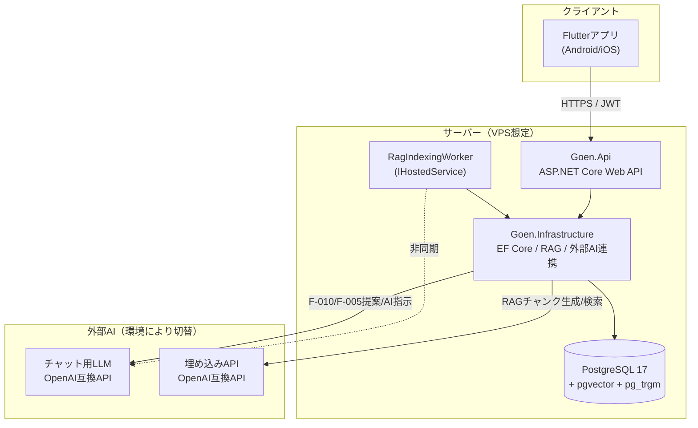
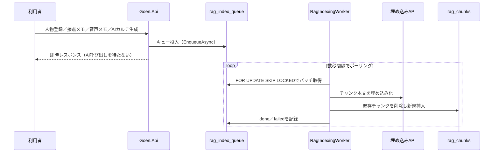
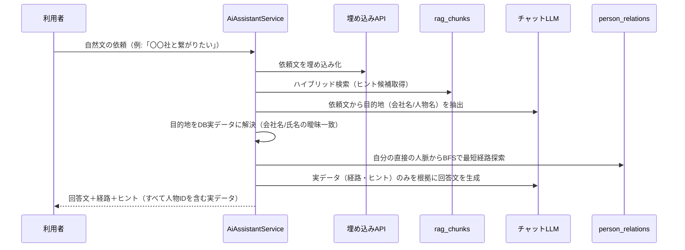

# 基本設計書

| 項目 | 内容 |
|---|---|
| プロジェクト名 | GOEN（HUMAN NETWORK OS／人脈OS） |
| 文書バージョン | 1.15 |
| 作成日 | 2026/07/25 |
| 作成者 | 阿部竜之介 |
| 対象要件 | 要件定義書 v1.18、テーブル設計書 v1.12 |

## 改訂履歴

| 版 | 日付 | 改訂内容 | 記入者 |
|---|---|---|---|
| 1.0 | 2026/07/25 | 初版作成。実装済みのスキャフォールドをもとに、システム構成・AI利用箇所・AIプロバイダ構成（モック／本番）・RAGパイプライン・AIアシスタント（経路提案）・人脈グラフ生成の各設計を記述 | 阿部 |
| 1.1 | 2026/07/25 | 人脈グラフのエッジ種別を`referrer`/`community`の2種類に縮小したことを反映（7章）。同僚等の自動リンクをエッジ生成からカルテメモへの自動追記に変更 | 阿部 |
| 1.2 | 2026/07/26 | 名刺OCR（F-007）をマルチモーダル対応のチャットLLM流用方式（`LlmVisionOcrService`）で実装したことを反映（2.3節・3.1節・8章・9章・13章） | 阿部 |
| 1.3 | 2026/08/02 | 通知機能（F-012、未実装のプレースホルダーのみ）を廃止し、紹介文（例文）作成機能（F-026、`IntroLetterService`）を新設したことを反映（3.1節・8章・9章）。あわせて未反映だったカルテ編集画面・接点詳細画面（メモ編集・Googleカレンダー連携）を画面一覧に追記 | 阿部 |
| 1.4 | 2026/08/04 | 要件定義書v1.7の追加要望を反映（設計のみ、未実装）。F-007に音声文字起こし＋AI自動反映、F-010にHPリンク・資料ファイル・接点メモを根拠に含める設計とDB永続化の明示、F-006を業種＞職種＞会社名＞人物のツリーレイアウトに変更する設計（7.4・7.5節新設）、F-027（他ユーザー人脈図の業種階層閲覧、7.6節新設）、F-028（相互人脈登録）を追記。3.1/3.2/8章/9章/13章を更新 | 阿部 |
| 1.5 | 2026/08/05 | 要件定義書v1.8でのQ-011〜Q-013解消を反映。7.5節を職種マスタ（`m_occupation_type`）参照方式に更新、3.1節のF-010を「資料ファイルはテキスト抽出せずマルチモーダルLLMへそのまま渡す」方式に更新、13章のB-007〜B-009を解消済みに更新 | 阿部 |
| 1.6 | 2026/08/09 | ダッシュボード機能（F-029、画面ID S-018、`/dashboard`）を新設・実装。`persons_read`の集計（総登録人数・業種別/職種別）と`next_actions`の期日近い順の取得のみで構成し、AIは使用しない。3.2節・8章・9章を更新 | 阿部 |
| 1.7 | 2026/08/09 | 重要度（`persons.importance`／`persons.importance_is_manual`／`persons_read.importance`）を廃止。ダッシュボードの重要度別内訳、人物一覧・カルテの★表示、人脈マップ・人物一覧のソート基準（最終接触日に変更）など、依存していた箇所を更新。3.2節・9章を更新 | 阿部 |
| 1.8 | 2026/08/09 | 職種追加・業種／職種管理機能（F-030、画面ID S-019）を新設・実装。`m_occupation_type`に`industry_code`（`m_industry`へのFK）を追加し、`MastersController`に業種・職種のCRUD（`GET/POST/PUT /api/masters/industries`, `GET/POST/PUT /api/masters/occupation-types`）を追加。人脈図（F-006）・ダッシュボード（F-029）が使う`persons_read.industry_name`は、`PersonReadSyncService`で人物の職種に紐づく業種を優先して導出するよう変更（会社の業種は未設定時のフォールバック）。職種の業種紐付けを変更した際は、その職種を使用中の全人物の`persons_read`を即時再同期する。3.1節・7.5節・8章・9章を更新 | 阿部 |
| 1.9 | 2026/08/09 | F-030の入力方式を「職種選択＋別画面での職種追加」から、人物登録・編集画面に業種・職種のコンボボックス（候補選択と自由入力の両対応）を直接配置する方式に変更。人物登録・更新API（`POST/PUT /api/persons`）が`occupationName`/`industryName`（自由入力の名称）を受け取り、新設の`MasterDataService`で名称の完全一致検索→再利用、なければ新規登録する処理に統一。既存職種に異なる業種名が入力された場合は職種の業種紐付け自体を更新し、対象人物全員の`persons_read`を再同期する（`MastersController`の管理画面編集時と同じ挙動をAPI側で共通化）。7.6節・9章を更新 | 阿部 |
| 1.10 | 2026/08/11 | F-026（紹介文作成、`IntroLetterService`）にHPリンク・資料ファイルの添付を追加。`ILlmService.ComposeTextAsync`に添付（`AttachmentInput`）パラメータを追加し、`OpenAiCompatibleChatClient`側でF-010と同じBase64データURL方式のマルチモーダル入力を自由文生成でも使えるよう汎化（`CallChatJsonWithAttachmentsAsync`と`CallChatTextWithAttachmentsAsync`でコンテンツパート構築ロジックを共通化）。HPリンク本文取得は`PersonsController`に private だった処理を`UrlTextFetcher`（`Goen.Infrastructure`）として切り出し、`PersonsController`・`IntroLetterService`の双方から共通利用する形に整理。`IntroLetterController`はファイル受信のため`[FromForm]`＋`IFormFile`によるmultipart/form-data方式に変更（`PersonsController.GenerateCard`と同じ方式）。3.1節・7章・9章を更新 | 阿部 |
| 1.11 | 2026/08/11 | Eight・HubSpotとの差別化方針を受け、F-031〜F-033を設計に追加（要件定義書v1.14）。うちF-032（AI要約の参照元表示）の裏付けとなる`RagChunkBuilder.BuildCardAsync`の実装を先行して修正：AIカルテ生成時に保存される`InputSourcesJson`（HPリンク・資料ファイルの参照元）が、これまでRAGチャンク化の対象から漏れていた（要約本文のみが埋め込まれ、参照元は`ai_person_cards`に保存されるだけでRAG検索・AI指示からは参照不可能だった）ため、参照元情報を独立した2つ目のチャンク（`chunk_no=1`）として追加で埋め込むよう修正。要約本文と同じチャンクに混ぜないのは、`AiAssistantService`がRAGヒントをLLMへ渡す際に本文を120文字へ切り詰めるため、混在させると参照元情報が埋もれて欠落するのを避けるため。F-031（AI指示→紹介文作成の引き継ぎ）・F-033（入力促進）は本バージョン時点ではUI・API側は未実装（設計のみ）。7.6節を更新 | 阿部 |
| 1.12 | 2026/08/15 | F-031・F-033のUI実装を追加（v1.11で設計のみとしていた残り分）。F-031: AI指示画面（S-017）の関連人物ヒントに「この人への紹介文を作成」ボタンを追加し、`go_router`の`extra`（`IntroLetterPrefill`：`personId`/`personName`/`requirement`下書き）経由で紹介文作成画面（S-014）へ遷移、対象人物・要件欄を入力済み状態で開始できるようにした。要件欄の下書きはヒントの提案理由・抜粋をテンプレート文言で結合したもの。F-033: 人物カルテ（S-006）に、AI要約未生成かつメモ・接点履歴が空の場合のみ表示する入力促進ヒントを追加（`Notifier<Set<String>>`による人物ID単位の非表示状態管理、Riverpod 3.x系では`StateProvider`が廃止されているため）。いずれもバックエンドAPIの追加は不要（既存のAI指示応答・カルテ取得APIが返す情報のみで完結） | 阿部 |
| 1.13 | 2026/08/15 | 3件のUI改善・新機能を実装。①人脈マップ（S-009）を開いた際に「自分」が画面中央に来るよう`TransformationController`で初期スクロール位置を計算し、業種・職種・会社名の全グループを折りたたんだ状態で開始するよう変更（従来は全展開・スクロール位置は既定の左上のままだった）。②AI指示（S-017、F-025）の経路・関連人物ヒントに、リスト表示に加えて図表示（`AiResultDiagram`）を追加し`SegmentedButton`で切替可能にした。図は人脈マップと同じ「自分を中心に左右2方向・分岐ごとに固定色」の視覚言語を踏襲し、経路は実線、ヒントは点線（`PathMetric`によるダッシュ描画）で区別する。③F-034（AI指示・紹介文作成の質問／回答履歴）を新設。`ai_assistant_queries`／`intro_letter_requests`の2テーブルを追加し（`migrations/0009_ai_assistant_and_intro_letter_history.sql`、テーブル設計書v1.11）、`AiAssistantService.AskAsync`・`IntroLetterService.GenerateAsync`それぞれの応答生成後に`owner_user_id`単位で履歴を保存（保存失敗は個別にtry-catchし主機能をブロックしない）。`GET /api/ai-assistant/history`・`GET /api/intro-letters/history`を新設し、各画面のAppBarから履歴一覧→詳細（読み返し専用、入力フォームへの復元なし）へ遷移できるようにした。AI指示の履歴詳細は現在の相談結果と同じ`AssistantResultView`（旧`_ResultView`を公開化）を再利用し、リスト／図表示の切替も履歴側で使える。3.1節・6章・7章・8章・9章を更新 | 阿部 |
| 1.14 | 2026/08/15 | F-038（AI自動リサーチ）を新設・実装。氏名・会社名からAIがWeb検索し公開情報の参考情報を生成する機能で、既存のAI要約（F-010）等とは異なりユーザー自身のデータではなく公開Web情報を根拠にする。`IWebSearchService`（検索API、要件I-006）を新設し、プロバイダ未選定のため`MockWebSearchService`（常に0件を返す）のみ登録。`PersonResearchService`（`Goen.Infrastructure/Research/`）が検索結果をLLM（既存の`ILlmService.ComposeTextAsync`を流用）に渡し、「検索結果にない事実の創作禁止」「同姓同名の可能性への言及」を強制するプロンプトで要約を生成する。検索結果0件時はLLMを呼ばず「見つからなかった」旨を固定文で返す（`AiAssistantService.ComposeAnswerAsync`と同じ考え方）。結果は`person_research_results`（人物1件につき最新1件、`migrations/0010_person_research_results.sql`、テーブル設計書v1.12）に保存。`POST /api/persons/{id}/research/generate`・`GET /api/persons/{id}/research`を新設し、会社名未設定の人物は400を返す（同姓同名誤認識を避けるため）。人物カルテ（S-006）にAI要約と同様の手動トリガー方式のセクションを追加し、生成結果には出典一覧と「公開Web情報をもとにした参考情報」の注記を常時表示する。3.1節・6章・7章・8章・9章を更新 | 阿部 |
| 1.15 | 2026/08/16 | Q-004を解消し2件を実装。①`IWebSearchService`の実装として`TavilyWebSearchService`（Tavily Search API、`POST https://api.tavily.com/search`）を追加。`WebSearchOptions`（`WebSearch:Provider`/`WebSearch:ApiKey`）を新設し、Provider≠mockのときのみ`AddHttpClient<IWebSearchService, TavilyWebSearchService>()`を登録する（他のAIプロバイダ設定と同じmock/real切替パターン）。②音声認識（I-002）を`LlmSpeechToTextService`で実装。名刺OCR（`LlmVisionOcrService`）と同じ考え方で、専用の音声認識APIを使わず`Ai:Chat`のマルチモーダルLLMへ音声をそのまま渡す。OpenAI互換のchat completionsにGeminiが対応する`input_audio`コンテンツパート（`{"type":"input_audio","input_audio":{"data":Base64,"format":"wav"等}}`）を新設し、MIMEタイプから`format`値へマッピングする。`ISpeechToTextService.TranscribeAsync`に`mimeType`引数を追加し、`PersonsController.UploadVoiceMemo`から`IFormFile.ContentType`を渡すよう変更。いずれもAi:Chat:Providerの条件分岐に相乗りする形で登録し、APIキー未設定時は既存のモック実装にフォールバックする。3.1節・6章・9章を更新 | 阿部 |

---

## 1. はじめに

### 1.1 本書の目的
本書は、要件定義書 v1.2・テーブル設計書 v1.1で定義した要件を実現するためのシステム構成・機能設計を記述する。特に、当初の要件定義・テーブル設計の各文書では詳細化されていなかった**AIの利用箇所**、および**モック／開発環境と本番環境で使用するAI APIの違い**を中心にまとめる。

### 1.2 対象範囲・前提
本書は現時点で実装済みのスキャフォールド（土台）を対象とする。Phase2以降（1to1・商談支援、紹介ニーズ管理、チーム共有等）の詳細設計は、当該フェーズの着手時に追補する。

---

## 2. システム構成

### 2.1 全体アーキテクチャ



### 2.2 レイヤー構成

| レイヤー | プロジェクト／ディレクトリ | 役割 |
|---|---|---|
| プレゼンテーション | `mobile/goen_app` | Flutter製モバイルアプリ。Riverpodで状態管理、go_routerで画面遷移 |
| API | `backend/src/Goen.Api` | Controllers、認証（JWT）、DI構成（`Program.cs`） |
| インフラ | `backend/src/Goen.Infrastructure` | EF Core DbContext、外部AI連携（`ExternalAi/`）、RAG（`Rag/`）、人脈グラフ探索（`Persistence/`） |
| ドメイン | `backend/src/Goen.Domain` | エンティティ定義 |
| データストア | PostgreSQL 17（pgvector・pg_trgm・pgcrypto） | RDB・ベクトル検索・トライグラム全文検索を単一DBに統合（テーブル設計書1.2） |

### 2.3 環境構成の違い（モック／開発／本番）

| 項目 | モック（AI未接続） | 開発（Ollama） | 本番想定 |
|---|---|---|---|
| DB | ネイティブPostgreSQLまたはDocker | 同左 | VPS上のPostgreSQL |
| チャットLLM | `MockLlmService`（固定ダミー応答） | Ollama（`gemma3:4b`） | Gemini（`gemini-2.5-flash`） |
| 埋め込み | `MockEmbeddingService`（決定的な疑似ベクトル） | Ollama（`multilingual-e5-large-instruct:q8_0`） | OpenAI（`text-embedding-3-small`） |
| OCR（名刺） | `MockOcrService`（固定ダミー応答） | `LlmVisionOcrService`（Ai:Chat設定を流用し`gemma3:4b`のマルチモーダル入力で読み取り） | Ai:Chat設定を流用し`gemini-2.5-flash`で読み取り想定（専用OCR APIは不要） |
| 音声認識 | `MockSpeechToTextService`（固定ダミー応答） | `LlmSpeechToTextService`（Ai:Chat設定を流用し`gemma3:4b`の音声入力で文字起こし） | Ai:Chat設定を流用し`gemini-2.5-flash`の`input_audio`で文字起こし想定（専用音声認識APIは不要） |
| Web検索（F-038 AI自動リサーチ） | `MockWebSearchService`（常に0件） | 同左（Tavilyは本番想定のみ、開発は0件のままでも支障なし） | `TavilyWebSearchService`（Tavily Search API） |
| 切替方法 | 既定値（`Ai:Chat:Provider`/`Ai:Embedding:Provider`/`WebSearch:Provider` = `mock`） | User Secretsに`ollama`を設定 | User Secretsに`gemini`/`openai`/`tavily`を設定 |
| コスト | 無料 | 無料（ローカル実行、要GPU/CPUリソース） | 従量課金（APIコール数・トークン数に依存） |
| 応答速度 | 即時 | 数秒〜1分程度（ローカル推論、初回モデルロードは特に遅い） | 数秒程度（クラウドAPI） |

「テスト環境」を独立して設けていない（開発＝モックまたはOllama、本番＝クラウドAPIの2区分）。CI等で自動テストを行う場合はモック（`mock`）を使用し、外部ネットワーク・GPUに依存しない構成とする。

---

## 3. AI利用箇所

要件定義書 v1.2で「人脈マップ画面自体はAIを使用しない」という設計方針を明文化した（F-006）。以下に、アプリ内でAIを使用する箇所・使用しない箇所を明確に整理する。

### 3.1 AIを使用する機能

| 機能ID | 画面／処理 | AI種別 | 用途 | AI障害時の挙動 |
|---|---|---|---|---|
| F-007 | 名刺撮影「この名刺を読み取る」 | チャットLLM（マルチモーダル） | 名刺画像から氏名・会社名・部署・役職・連絡先をJSONで抽出（`LlmVisionOcrService`、Ai:Chat設定を流用）。確認画面で音声文字起こし（テキスト）が入力されている場合は、OCR結果と文字起こしテキストを合わせてLLMに渡し、登録項目を補完・統合する | 例外を返す（利用者が再撮影・再録音または手入力に切替） |
| F-010 | 人物カルテ「AIカルテを生成する」 | チャットLLM（マルチモーダル） | 名刺情報・音声メモ・接点履歴のメモ（既存の全接点の`note`）・前回世代の要約（存在する場合）・任意で追加されたHPリンクの取得本文から人物カルテ項目（要約・事業・課題・紹介者・趣味）を抽出。資料ファイル（画像・PDF・プレーンテキスト）は独自のテキスト抽出を行わず、`LlmVisionOcrService`と同様にBase64データとしてそのままチャットLLMへ渡し、LLM自身に内容を解釈させる | 例外を返す（利用者が再実行）。HPリンク取得の失敗は個別に無視し、他の情報で生成を継続する |
| F-005（提案経路） | 人物カルテ「AIに関係性を提案してもらう」 | チャットLLM | 候補者一覧と対象人物を比較し、人脈関係（紹介者／人脈・知人）を提案 | 例外を返す（利用者が再実行） |
| F-025 | AI指示画面（人脈マップ→「AIに相談する」） | チャットLLM＋埋め込み | ①依頼文の埋め込み化とRAGハイブリッド検索によるヒント抽出、②依頼文からのLLMによる目的地抽出、③実データ（経路・ヒント）をもとにした回答文生成 | 各段階を個別にtry-catchし、失敗した段階は空扱いとして処理を継続（画面全体を失敗させない） |
| F-026 | 紹介文作成画面（ホーム→「例文作成」） | チャットLLM（マルチモーダル、添付がある場合） | 対象人物のDB実データ（会社・役職・AI要約・事業内容・課題・趣味・カルテメモ・直近の接点メモ）と要件・トーン等の入力条件、任意で添付されたHPリンクの本文・資料ファイルから、送信可能なメッセージの下書きを1件生成（`IntroLetterService`）。HPリンク取得・資料ファイルの扱いはF-010と同じ方式 | 例外を返す（利用者が条件を変えず再実行可能）。HPリンク取得の失敗は個別に無視し、他の情報で生成を継続する |
| RAGインデックス作成 | バックグラウンド（`RagIndexingWorker`） | 埋め込み | 人物登録・更新、接点メモ、音声文字起こし、AIカルテ生成のたびにチャンクを再生成 | キューに残り、次回ポーリング時にリトライ（最大3回） |

### 3.2 AIを使用しない機能（設計上、意図的に除外）

| 機能ID | 画面／処理 | 代替手段 |
|---|---|---|
| F-006 | 人脈マップ画面（自分中心ツリー／特定人物起点マップ） | `person_relations`を再帰CTE・BFSで探索し、業種→職種（`persons.occupation_code`）→会社名→人物の階層でグルーピングして描画するのみ。業種は職種に紐づく業種（`m_occupation_type.industry_code`）を優先し、未設定の場合のみ会社の業種（`companies.industry_code`）を使用する（F-030）。折りたたみ時の人数は各グループ配下の件数をカウントするだけ。表示内容はDBの実データそのもの |
| F-027 | 他ユーザーの人脈図の閲覧（業種階層まで） | 対象ユーザーの`persons`を`companies.industry_code`でGROUP BY集計するのみ。職種・会社名・人物の詳細クエリ自体を発行しない（アプリ側で下位階層への遷移操作を提供しない） |
| F-005（自動生成） | 人物登録時の関係自動生成 | 選択式の紹介者指定による「紹介者」自動生成のみ（ルールベース）。同じ会社の登録済み人物がいる場合はエッジではなく、人物カルテのメモへ「社内に○○さんが在籍」という一文を自動追記する |
| F-005（手動登録） | 人物カルテ「手動で関係を追加」 | 利用者が相手・関係種別（紹介者／人脈・知人）・強さを直接指定 |
| F-002／F-003 | 人物データの登録・編集・削除（ソート順切替・総件数表示を含む） | 通常のCRUD |
| F-011 | 接点履歴の閲覧 | 通常のCRUD |
| F-001（生体認証） | ログイン時の指紋・顔認証 | 端末OS標準の生体認証機構（Face ID／指紋認証）を呼び出し、成功結果のみを受け取ってセキュアストレージ保存済みのトークンでログインする。生体情報自体はGOENのサーバーへ送信しない |
| F-028 | 相互人脈登録 | 登録時に入力されたメールアドレスと`users.email`の完全一致判定のみで実行するルールベース処理。あいまい一致・AIによる名寄せは行わない |
| F-029 | ダッシュボード | `persons_read`を自分の担当分のみGROUP BY集計（業種別・職種別）するのみ。次回アクションは`next_actions`を期日の近い順に取得するだけの通常のCRUD参照 |
| F-030 | 職種追加・業種／職種管理 | `m_industry`・`m_occupation_type`に対する通常のCRUD（名称変更・業種紐付け・有効/無効切替）のみ。同名の既存データがあれば再利用し、重複作成を避けるルールベース処理 |

### 3.3 設計思想：AIの利用箇所を限定した理由
1. **人脈マップの可読性**：AIによる関係の自動生成・提案を人脈マップ画面に混在させると、確度の異なる情報（確実な自己申告データとAIの推定）が同列に表示され、画面が煩雑になる。関係データの「生成」と「閲覧」を分離し、閲覧画面は常にDB確定データのみを表示する。
2. **コストと速度**：会社名一致・紹介者選択のようにルールで確実に導ける関係は、AI（LLM）を呼ばずに即時・無料で処理する。AIは「ルールでは導けない曖昧な関係の発見」という、本来AIが価値を発揮する領域に限定して使う。
3. **ハルシネーション対策**：AI指示機能（F-025）の経路・ヒントに含まれる人物データは、すべて`AiAssistantService`がDBから構築した実データであり、LLMは「実データをもとに説明文を書く」役割のみを担う。LLMが人物名を創作するリスクを構造的に排除している。

---

## 4. AIプロバイダ構成

### 4.1 なぜプロバイダを設定変更のみで切替できるのか
Groq・Ollama・Gemini・OpenAIはいずれも**OpenAI互換のAPI形式**（`/v1/chat/completions`、`/v1/embeddings`）に対応している。そのため、プロバイダ専用のコードを書かず、汎用クライアントを1つずつ実装した。

| 汎用クライアント | 実装するインターフェース | 対応プロバイダ |
|---|---|---|
| `OpenAiCompatibleChatClient` | `ILlmService` | Ollama（gemma3等）・Groq・Gemini・OpenAI |
| `OpenAiCompatibleEmbeddingService` | `IEmbeddingService` | Ollama（multilingual-e5等）・OpenAI |

`Program.cs`は`Ai:Chat:Provider`／`Ai:Embedding:Provider`が`mock`以外であれば上記クライアントをDI登録し、`mock`であればダミー実装（`MockLlmService`／`MockEmbeddingService`）を登録する。**プロバイダの追加・変更はコントローラー等の呼び出し側コードの変更を必要としない。**

### 4.2 設定項目一覧

| キー | 既定値（appsettings.json） | 説明 |
|---|---|---|
| `Ai:Chat:Provider` | `mock` | `mock` / `ollama` / `groq` / `gemini` / `openai` |
| `Ai:Chat:BaseUrl` | `http://localhost:11434/v1` | チャットAPIのベースURL |
| `Ai:Chat:Model` | `gemma3:4b` | モデル名 |
| `Ai:Chat:ApiKey` | 空 | User Secretsで設定する（Ollamaは任意の値でよい） |
| `Ai:Embedding:Provider` | `mock` | `mock` / `ollama` / `openai` |
| `Ai:Embedding:BaseUrl` | `http://localhost:11434/v1` | 埋め込みAPIのベースURL |
| `Ai:Embedding:Model` | `jeffh/intfloat-multilingual-e5-large-instruct:q8_0` | モデル名（Ollamaはタグ必須） |
| `Ai:Embedding:ApiKey` | 空 | User Secretsで設定する |
| `Ai:Embedding:Dimension` | `1024` | 埋め込みベクトルの次元数。`rag_chunks.embedding`の型と一致させる |
| `Ai:Embedding:QueryPrefix` | `query: ` | multilingual-e5系モデル向けの検索クエリ接頭辞 |
| `Ai:Embedding:DocumentPrefix` | `passage: ` | multilingual-e5系モデル向けの被検索文書接頭辞 |

APIキーは`appsettings.json`／`appsettings.Development.json`に書かず、[.NET User Secrets](https://learn.microsoft.com/aspnet/core/security/app-secrets)で管理する（リポジトリにコミットされない）。

### 4.3 環境別の設定例

**開発（Ollama）**
```bash
dotnet user-secrets set "Ai:Chat:Provider" "ollama"
dotnet user-secrets set "Ai:Chat:Model" "gemma3:4b"
dotnet user-secrets set "Ai:Embedding:Provider" "ollama"
dotnet user-secrets set "Ai:Embedding:Model" "jeffh/intfloat-multilingual-e5-large-instruct:q8_0"
dotnet user-secrets set "Ai:Embedding:Dimension" "1024"
```

**本番想定（Gemini + OpenAI）**
```bash
dotnet user-secrets set "Ai:Chat:Provider" "gemini"
dotnet user-secrets set "Ai:Chat:BaseUrl" "https://generativelanguage.googleapis.com/v1beta/openai"
dotnet user-secrets set "Ai:Chat:Model" "gemini-2.5-flash"
dotnet user-secrets set "Ai:Chat:ApiKey" "<Gemini APIキー>"

dotnet user-secrets set "Ai:Embedding:Provider" "openai"
dotnet user-secrets set "Ai:Embedding:BaseUrl" "https://api.openai.com/v1"
dotnet user-secrets set "Ai:Embedding:Model" "text-embedding-3-small"
dotnet user-secrets set "Ai:Embedding:ApiKey" "<OpenAI APIキー>"
dotnet user-secrets set "Ai:Embedding:Dimension" "1536"
dotnet user-secrets set "Ai:Embedding:QueryPrefix" ""
dotnet user-secrets set "Ai:Embedding:DocumentPrefix" ""
```

### 4.4 チャットと埋め込みで切替の重さが異なる点（重要）

| 項目 | チャット（LLM）の切替 | 埋め込みの切替 |
|---|---|---|
| コード変更 | 不要 | 不要 |
| 設定変更 | 必要（Provider/BaseUrl/Model/ApiKey） | 必要（同左＋Dimension／Prefix） |
| 既存データへの影響 | **なし** | **あり**：ベクトル空間・次元数がモデルごとに異なるため、`rag_chunks`の全チャンクを新モデルで再生成する必要がある |
| 手順 | 設定を変更して再起動するのみ | ①`rag_chunks.embedding`の次元数を新モデルに合わせて変更（新テーブル作成→リネームで切替、テーブル設計書4.4節）②`rag_index_queue`へ全件再投入し、ワーカーに再生成させる |

これは実装固有の制約ではなく、埋め込みモデル全般に共通する性質である（異なるモデルが生成するベクトルは互いに比較不能）。

### 4.5 Groqについて
開発初期にはGroq（`llama-3.3-70b-versatile`）をチャット用LLMとして接続していたが、Groqには埋め込みAPIが存在しないため、埋め込みが必要なRAG機能の実装にあたりOllama（multilingual-e5）へ切り替えた。`Ai:Chat:Provider`に`groq`を指定すれば、チャット用途に限り現在も利用可能。

---

## 5. RAGパイプライン設計（F-025関連）

### 5.1 チャンク生成ルール

| `source_type` | 元データ | チャンク化の単位 |
|---|---|---|
| `profile` | `persons`／`person_profiles` | 氏名・会社名・業種・都道府県・役職・メモを1チャンクに集約（独自追加。地域等での検索に対応） |
| `card` | `ai_person_cards`（最新世代のみ） | AI要約＋事業＋課題＋趣味＋強みをまとめて1チャンク |
| `transcript` | `transcripts` | 本文を700文字・100文字オーバーラップで分割（テーブル設計書4.2） |
| `note` | `contacts.note` | 接点メモ1件＝1チャンク（メモが空の場合は生成しない） |

### 5.2 非同期インデックスワーカー



保存操作（人物登録等）自体は外部AI呼び出しの完了を待たずに完了する。これは要件定義書のRAG検索応答性能・および設計要件「外部LLM APIの応答時間がユーザーの保存操作をブロックしないようにする」（テーブル設計書4.1）を満たすための設計。

### 5.3 ハイブリッド検索
ベクトル検索（`embedding <=> クエリベクトル`）と全文検索（pg_trgmの`similarity()`/`%`演算子）の結果をRRF（Reciprocal Rank Fusion）で統合する。実装SQLはテーブル設計書9.1節を参照。

---

## 6. AIアシスタント（経路提案・ヒント）設計（F-025）

### 6.1 処理フロー



### 6.2 ハルシネーション防止設計
- 経路（`routes`）・ヒント（`hints`）はいずれも`AiAssistantService`がDBクエリの結果から構築する。LLMはこれらのデータを**生成しない**。
- 目的地抽出（会社名・人物名）はLLMの出力をそのまま信用せず、必ずDBに対して曖昧一致検索を行い、実在するレコードに解決できた場合のみ経路探索を実行する。
- 最終回答生成のプロンプトには「実データに存在しない人物名・会社名を創作してはいけない」「データが不十分な場合は正直に伝える」ことを明示的に指示する。

### 6.3 経路探索アルゴリズム
自分（ログインユーザー）が担当する人物（depth1）を起点集合とし、`person_relations`を組織スコープで全件メモリに読み込んだうえで幅優先探索（BFS、双方向探索）を行う。目的地（対象人物、または対象会社に所属する人物のいずれか）に到達した時点で探索を打ち切り、最短経路を復元する。深さの上限は設けていないが、組織内のデータ量が実用上のスコープであるため許容している（大規模データでは要見直し）。

### 6.4 堅牢性
埋め込みAPI・チャットLLMのいずれかが一時的に利用できない場合でも、該当する処理（RAGヒント検索／経路探索）のみを空扱いとし、リクエスト全体を失敗させない（呼び出し元へ500エラーを返さない）設計とした。

---

## 7. 人脈グラフ生成設計（F-005、AI不使用パート）

### 7.1 自動生成ルール
`person_relations`は紹介経路探索（BFS）に使える人脈のつながりのみを持ち、`relation_type`は`referrer`（紹介元）と`community`（人脈・知人）の2種類に限定している。同僚・取引先・パートナーのような組織上／取引上の関係は、会社名が一致するだけの人物を無条件にエッジ化すると大企業で組み合わせ爆発する上、紹介経路探索のノイズにもなるため、エッジ化せず人物カルテのメモ（テキスト）に記録し、RAG検索（F-025）の補足情報として提示する方式に統一した。

| ルール | トリガー | 動作 |
|---|---|---|
| 紹介者の選択式指定 | 人物登録画面で紹介者を選択 | `person_relations`に`referrer`（紹介者→新規人物）を生成 |
| 同一会社の人物メモ追記 | 人物新規登録時、会社名が既存人物と一致 | エッジは生成せず、新規人物の`person_profiles.note`へ「社内に○○さんが在籍」という一文を自動追記（RAGインデックス対象） |

いずれもLLMを呼び出さず、`PersonsController.Create`内で完結する。

### 7.2 手動登録・AI提案
- 手動登録：`AddRelationScreen`から相手・関係種別（`referrer`/`community`）・強さを指定し`POST /api/persons/{id}/relations`で確定登録。
- AI提案：`GET /api/persons/{id}/relations/suggest`でLLMに候補者一覧と比較させ`referrer`/`community`のいずれかを提案させ、提案内容を利用者が選択して同エンドポイントで確定登録。同じ会社であること自体は紹介関係の根拠にならないため、プロンプト上も提案の直接的な理由としては使わない。

### 7.3 画面分離の設計思想
人脈マップ（`NetworkMapScreen`／`PersonNetworkScreen`）は`GraphView`共通ウィジェットで描画し、AI関連の処理を一切呼び出さない。関係の"生成"（本章）と"閲覧"（人脈マップ）を明確に分離することで、閲覧画面の表示内容は常にDB確定データのみとなる。

### 7.4 ツリーレイアウトへの変更（業種＞職種＞会社名＞人物）

要件定義書v1.7でF-006の見た目を、自分中心の同心円マインドマップから、Mapify等に近い左右展開のツリー形式へ変更した。設計方針は以下のとおり。

| 項目 | 内容 |
|---|---|
| 階層構造 | 自分（起点）→業種→職種（`persons.occupation_code`、職種マスタ参照。7.5節参照）→会社名（`companies.company_name`）→人物、の順にグルーピングする。業種は職種に紐づく業種（`m_occupation_type.industry_code`、業種マスタの名称を使用）を優先し、職種が未設定または業種が紐付けられていない場合のみ会社の業種（`companies.industry_code`）にフォールバックする（7.6節参照） |
| 未設定時の扱い | 業種・職種・会社名のいずれかが未設定の人物は、それぞれ「業種未設定」「職種未設定」等の1グループにまとめる（グルーピング対象から除外しない） |
| 折りたたみ | 業種・職種・会社名の各ノードはUI側の状態としてのみ開閉を保持する（DBには保存しない）。折りたたんだノードには、配下に含まれる人物件数をラベルとして表示する（`COUNT`はクライアント側でツリー構築時に集計するか、`GET /api/network`のレスポンスに件数を含めて返す） |
| 関係線の描画 | `person_relations`（`referrer`/`community`）は既存どおりBFS・再帰CTEで取得し、階層ツリー上の該当する人物ノード同士を結ぶ線として重ねて描画する。階層構造そのものは関係グラフ（エッジ）とは独立した、属性ベースのグルーピングである |
| 実装コンポーネント | 既存の`GraphView`ウィジェットのレイアウトアルゴリズムを、同心円配置からツリー（階層）配置に置き換える。ノード＝人物または階層グループ、エッジ＝紹介者・人脈知人関係、という既存のデータモデルは変更しない |

### 7.5 「職種」項目の新設

人脈図の階層に必要な「職種」は、既存の`persons.job_title`（役職：部長・課長等の肩書き）とは異なる概念（営業・エンジニア・デザイナー等の職務分類）のため、新規項目として設計する。Q-011（要件定義書）の解消により、業種（`m_industry`）と同様の静的マスタ`m_occupation_type`を新設し、`persons.occupation_code`で参照する選択式とすることが確定した（テーブル設計書7.6・7.21節参照）。未設定は「職種未設定」の1グループにまとめる（7.4節の未設定時の扱いと同様）。

### 7.6 職種追加・業種／職種管理（F-030）の設計

`companies.industry_code`は会社登録時に入力する経路がなく（会社名は自由入力のみ）、実運用では常にNULLとなっていた。一方、職種は人物登録・編集画面に選択式のドロップダウンが既に存在し、ほぼすべての人物で選択可能な状態にある。この非対称を解消するため、業種を「会社に紐づくもの」から「職種に紐づくもの」へ設計変更した。当初はドロップダウン＋別画面（職種追加シート）での追加方式で実装したが、画面遷移を挟む煩雑さを解消するため、会社名欄と同じ「自由入力＋未登録なら保存時に即登録」というコンボボックス方式に統一した（1.9改訂）。

| 項目 | 内容 |
|---|---|
| スキーマ変更 | `m_occupation_type`に`industry_code`（`m_industry`への任意FK）を追加（マイグレーション`0008_occupation_industry_link.sql`）。`m_industry`・`m_occupation_type`はいずれも静的マスタ（`h_*`履歴テーブルを持たない）ため、`persons`のような列同期対応は不要 |
| 登録・編集画面のUI | `IndustryComboBox`／`OccupationComboBox`（Flutterの`Autocomplete`ウィジェットを外部`TextEditingController`と組み合わせて実装）を人物登録・編集画面に直接配置する。候補は`GET /api/masters/industries`・`/occupation-types`から取得し活性データのみ表示するが、候補にない文字列もそのまま入力できる。会社名欄と同様、値は名称の自由入力テキストとして`CreatePersonRequest`/`UpdatePersonRequest`の`IndustryName`/`OccupationName`に送信する（`OccupationCode`は廃止） |
| 名称解決・重複防止 | `PersonsController`の`Create`/`Update`は、新設の`MasterDataService.ResolveOccupationAsync(occupationName, industryName)`へ委譲する。業種名・職種名とも大文字小文字を区別しない完全一致で既存レコードを検索し、存在すれば再利用、なければ新規登録する。既存の職種名に、現在の紐付けと異なる業種名が指定された場合は、その職種の`industry_code`自体を更新する（同じ職種を使う全人物に影響する仕様であることを前提とする） |
| 削除ではなく無効化 | `persons.occupation_code`・`persons_read`等から参照されている可能性があるため、業種・職種とも物理削除は行わず`is_active`のON/OFFのみで運用する。一覧取得系API（`GET /api/masters/*`）は管理画面での編集対象とするため非活性データも含めて返し、コンボボックス側でのみ活性データに絞り込む |
| persons_readの即時反映 | `persons_read.industry_name`は人物の書き込み時にのみ再同期される設計（`PersonReadSyncService`）だが、それだけでは「既存職種の業種紐付けを後から変更した」ケースに追従できない。そのため`MasterDataService.ResolveOccupationAsync`（人物登録・編集経由）・`MastersController.UpdateOccupationType`（管理画面経由）のいずれも、対象職種の`industry_code`が変化した場合に限り`PersonReadSyncService.RefreshAllForOccupationAsync`を呼び、その職種を使用中の全人物のダッシュボード・人脈図表示へ即時反映させる |
| 管理画面（S-019）からの追加 | 業種・職種管理画面自体の「追加」操作は、職種追加ダイアログ（職種名＋業種の選択/新規作成）を引き続き使用する。人物登録・編集画面のコンボボックスとは異なる利用文脈（明示的なマスタ追加）のため、UIパターンを統一する必要はないと判断した |

### 7.7 他ユーザーの人脈図閲覧（F-027）の設計

閲覧対象ユーザーを選択すると、`GET /api/network?userId={対象ユーザーID}&scope=industry`のような専用の集計エンドポイント（新設）を呼び出し、対象ユーザーの`persons`を業種でGROUP BYした「業種名＋件数」のみを返す。既存の`GET /api/network`（自分用、ノード＋エッジの詳細を返す）とはレスポンス形状を明確に分離し、実装上も職種・会社名・人物の詳細を一切含まないレスポンスとすることで、フロント側の実装ミスによる情報漏えいを構造的に防ぐ。

---

## 8. 画面一覧（実装状況）

| 画面ID | 画面名 | ルート | 実装状況 |
|---|---|---|---|
| S-001 | ログイン | `/login` | 実装済み（メール・パスワードのみ）。生体認証ログインは未実装（設計のみ、要件定義書F-001参照） |
| S-002 | ホーム | `/home` | 実装済み |
| S-003 | 名刺撮影 | `/persons/new/card` | 実装済み（OCRはマルチモーダルチャットLLM、開発環境はgemma3:4b） |
| S-004 | 登録内容確認 | `/persons/new/confirm` | 実装済み。音声文字起こし入力とAIによる登録項目自動反映（F-007拡張）は未実装（設計のみ） |
| S-005 | 音声メモ入力 | `/persons/:id/voice-memo` | テキスト代替のみ実装 |
| S-006 | 人物カルテ | `/persons/:id` | 実装済み。AI要約生成時にHPリンク・資料ファイルを任意で追加入力できる（F-010拡張）。氏名・会社名からAIがWeb検索して参考情報を生成するAIリサーチに対応（F-038） |
| S-007 | 人物一覧 | `/persons` | 実装済み。ソート順切替・総登録人数表示（F-003拡張）は未実装（設計のみ） |
| S-008 | 検索 | `/search` | 簡易版（部分一致）のみ |
| S-009 | 人脈マップ（自分中心） | `/network-map` | 業種＞職種＞会社名＞人物のツリー形式で実装済み（AI不使用、7.4節）。業種は職種に紐づく業種を優先して用いる（F-030、7.6節）。他ユーザー閲覧（F-027、7.7節）も実装済み |
| S-019 | 業種・職種の管理 | `/masters/manage` | 実装済み（AI不使用）。業種・職種の一覧表示、名称変更、職種の業種紐付け変更、有効/無効切替（F-030、7.6節） |
| － | 人脈マップ（人物起点） | `/persons/:id/network` | 実装済み（AI不使用） |
| － | 関係を手動で追加 | `/persons/:id/relations/new` | 実装済み |
| － | カルテを編集 | `/persons/:id/edit` | 実装済み |
| － | 接点詳細（メモ編集・Googleカレンダー連携） | `/persons/:id/contacts/:contactId` | 実装済み |
| S-014 | 紹介文作成 | `/intro-letter` | 実装済み（F-012 通知一覧を廃止し置き換え）。HPリンク・資料ファイルの添付に対応。過去の依頼・生成結果の履歴（`/intro-letter/history`、F-034）に対応 |
| S-015 | 設定 | `/settings` | ログアウトのみ実装。生体認証・相互人脈登録（F-028）のON/OFF切替は未実装（設計のみ） |
| S-017 | AI指示 | `/network-map/ai-assistant` | 実装済み。経路・関連人物ヒントのリスト／図表示切替、過去の質問・回答の履歴（`/network-map/ai-assistant/history`、F-034）に対応 |
| S-018 | ダッシュボード | `/dashboard` | 実装済み（AI不使用） |

Phase2以降の画面（S-010〜S-013、S-016）は未実装。

---

## 9. API一覧（主要エンドポイント）

| メソッド／パス | 概要 | AI使用 |
|---|---|---|
| `POST /api/auth/login`、`/refresh` | 認証（F-001） | なし |
| `GET/POST/PUT/DELETE /api/persons` | 人物CRUD（F-002/F-003）。ソート順指定・総件数取得を含む（未実装）。登録時、入力メールアドレスが既存ユーザーと一致する場合は相手側への相互人脈登録（F-028、未実装）を行う。業種・職種は自由入力名称（`IndustryName`/`OccupationName`）で受け取り、`MasterDataService`が名称解決・未登録時の即時登録を行う（F-030） | なし（会社名一致・紹介者指定の自動関係生成、業種・職種の名称解決を含む） |
| `POST /api/persons/ocr-draft` | 名刺OCR（F-007）。音声文字起こしテキストが併せて送信された場合はOCR結果と統合する（未実装） | チャットLLM（マルチモーダル、`LlmVisionOcrService`） |
| `POST /api/persons/{id}/contacts` | 接点登録（F-011、日時・場所・メモ入力可） | なし |
| `PUT /api/persons/{id}/contacts/{contactId}` | 接点メモの編集（F-011） | なし |
| `POST /api/persons/{id}/contacts/{id}/voice-memo` | 音声文字起こし（F-009） | チャットLLM（マルチモーダル、音声入力） |
| `POST /api/persons/{id}/cards/generate` | AIカルテ生成（F-010）。接点メモ全件・前回世代の要約・HPリンク／ファイル（任意）を入力に含める | チャットLLM |
| `POST /api/persons/{id}/research/generate` | AI自動リサーチ（F-038）。氏名・会社名でWeb検索し、公開情報の参考情報を出典付きで生成・保存する。会社名未設定の場合は400を返す | Web検索（ダミー実装）＋チャットLLM |
| `GET /api/persons/{id}/research` | AI自動リサーチの既存結果取得（未生成の場合はnull） | なし |
| `GET /api/persons/{id}/relations/suggest` | AI関係提案（F-005） | チャットLLM |
| `POST /api/persons/{id}/relations` | 関係確定登録（F-005、手動／AI提案共通） | なし |
| `GET /api/persons/{id}/network` | 人物起点グラフ取得（F-006、業種＞職種＞会社名＞人物のツリー形式へ変更予定・未実装） | なし |
| `GET /api/network` | 自分中心グラフ取得（F-006、同上） | なし |
| `GET /api/network?userId=&scope=industry` | 他ユーザーの業種階層のみのグラフ取得（F-027、新設・未実装） | なし |
| `POST /api/ai-assistant/query` | AI指示（F-025）。応答は`ai_assistant_queries`へ`owner_user_id`単位で自動保存される（F-034） | チャットLLM＋埋め込み |
| `GET /api/ai-assistant/history` | AI指示の質問・回答履歴一覧（F-034、最新50件） | なし |
| `POST /api/intro-letters/generate` | 紹介文（例文）作成（F-026）。multipart/form-dataでHPリンク・資料ファイルを任意添付できる（`PersonsController.GenerateCard`と同方式）。生成結果は`intro_letter_requests`へ`owner_user_id`単位で自動保存される（添付ファイルはファイル名のみ、F-034） | チャットLLM（添付時はマルチモーダル） |
| `GET /api/intro-letters/history` | 紹介文作成の依頼・生成結果履歴一覧（F-034、最新50件） | なし |
| `GET /api/dashboard` | ダッシュボード（F-029）。総登録人数、業種別/職種別の内訳、次回アクション上位5件を返す | なし |
| `GET/POST/PUT /api/masters/industries` | 業種のCRUD（F-030）。一覧取得・新規作成（同名は既存を再利用）・名称/有効無効の更新 | なし |
| `GET/POST/PUT /api/masters/occupation-types` | 職種のCRUD（F-030）。一覧取得・新規作成（業種の選択/新規作成を同時指定可）・名称/紐づく業種/有効無効の更新。業種紐付けの変更時は対象職種を使用中の全人物の`persons_read`を再同期する | なし |

---

## 10. データベース設計との関係
テーブル定義・インデックス方針・履歴管理方式の詳細はテーブル設計書_GOEN_v1.0.md（v1.1）を参照する。本書ではAI関連の実装判断（埋め込み次元数の確定、pg_trgm採用、pgvectorアクセス方式）のみ言及し、詳細はテーブル設計書側に一本化する。

---

## 11. 非機能要件への対応状況

| 分類 | 内容 | 実装状況 |
|---|---|---|
| 性能 | AI指示のタイムアウト | クライアント（Flutter）側は120秒。ローカルLLM（Ollama）は初回モデルロード等で本番のクラウドAPIより遅くなりうるため、他のAPI呼び出し（既定10秒）とは別枠で設定 |
| 可用性 | 外部AI障害時の扱い | F-025は各処理段階を個別にtry-catchし部分的な結果を返す。F-010／F-005提案は例外を返し利用者に再実行を促す |
| セキュリティ | APIキー管理 | .NET User Secretsで管理し、リポジトリにコミットしない（本番はKey Vault等への移行を推奨） |
| セキュリティ | 個人情報の外部送信 | 開発環境（Ollama）はローカル完結のため外部送信なし。本番（Gemini/OpenAI）は学習利用不可設定の確認が必要（Q-004） |

---

## 12. 開発環境構築
Docker／ネイティブPostgreSQLのセットアップ、Ollamaのインストール・モデル取得、Visual Studio／Android Studioでの実行手順はリポジトリ直下の`README.md`にまとめている。本書では設計判断の記述に留め、手順の重複記載は避ける。

---

## 13. 未決事項・今後の課題

| ID | 内容 | 関連 |
|---|---|---|
| B-001 | **解消**（Q-004）：音声認識サービスの選定。OCR（`LlmVisionOcrService`）と同じ方式でチャットLLMのマルチモーダル音声入力（`LlmSpeechToTextService`）を流用する形に確定。精度・コスト面で専用の音声認識APIへの切替も将来の選択肢として残る | 2.3 |
| B-002 | 埋め込みモデルを本番（text-embedding-3-small）へ切り替える際の再埋め込みジョブの実装（現状は手順のみ定義、自動化スクリプト未実装） | 4.4 |
| B-003 | AI指示の経路探索結果に応じて人脈マップ上の該当ノードのみを絞り込み表示するPhase2機能（`routes`/`hints`は既に人物IDを含むため、フロント側のフィルタ実装のみで対応できる見込み） | 6 |
| B-004 | RAGインデックスワーカーの障害監視・アラート（現状はログ出力のみ） | 5.2 |
| B-005 | 大規模データ時のBFS経路探索の性能（現状は組織内の`person_relations`全件をメモリに読み込む方式） | 6.3 |
| B-006 | 人脈図ツリー（業種＞職種＞会社名＞人物）のフロント実装方式（`GraphView`のレイアウトアルゴリズム置き換え、または新規ウィジェット化の判断） | 7.4 |
| B-007 | **解消**（Q-011）：「職種」は自由入力ではなく`m_occupation_type`マスタを新設し選択式とする方式に確定。マスタの初期データ投入（職種の具体的な項目立て）は詳細設計時に行う | 7.5 |
| B-008 | **解消**（Q-012）：AI人物カルテの資料ファイルは独自のテキスト抽出を行わず、名刺OCRと同様にマルチモーダルLLMへそのまま渡す方式に確定。対応形式は画像・PDF・プレーンテキストとし、Office文書は対象外 | 3.1 |
| B-009 | **解消**（Q-013）：相互人脈登録は既定値ON、設定画面でOFF切替可能、告知は画面上表示のみで確定。`users.allow_mutual_registration`を新設（テーブル設計書7.4節） | 3.2 |
